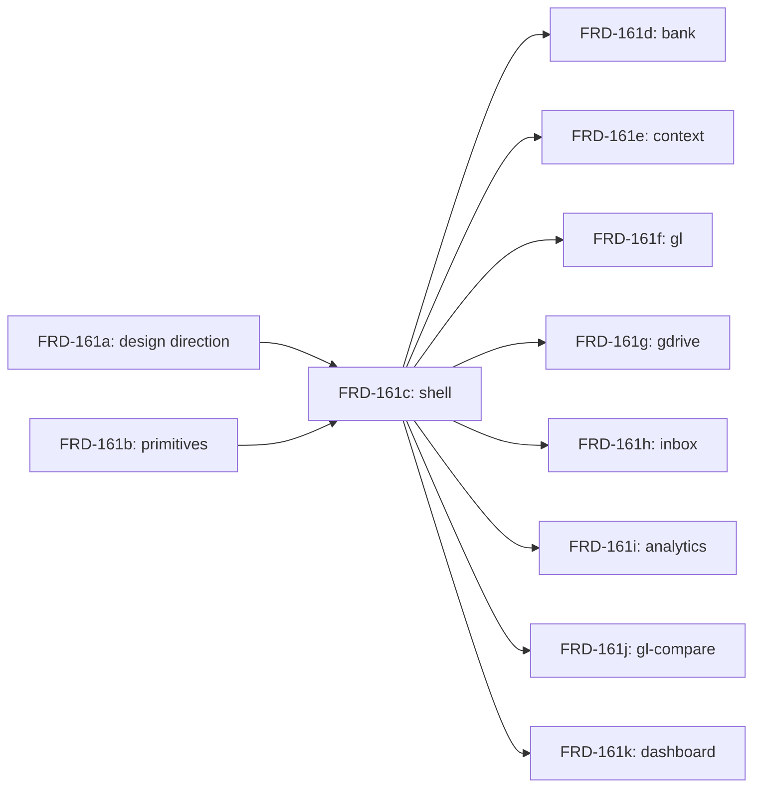

# Outcome
<one-line user-visible result of shipping the whole umbrella;
 e.g. "Gridfin shell + 8 page surfaces match the new design system">

# Slices
<ordered list. one entry per child issue. order is dispatch order
 along the DAG below, not arbitrary.

 each slice has a stable `slice-id` field: the parent issue id with
 a single-letter suffix (e.g. FRD-161a, FRD-161b, ...). slice-ids are
 stable across re-grooming — once assigned, a slice-id does not change.
 the materialize step uses slice-ids to detect already-created children
 on retry.>

## <slice-id> — <slice title>
slice-id: <stable id, e.g. FRD-161a>
**Scope:**       <one sentence: what this slice does, what it leaves out>
**Evidence:**    <file paths + line counts or specific patterns that bound this slice>
**Dependencies:** <other slice-ids that must complete first; or `none`>

## <slice-id> — <slice title>
slice-id: <next stable id>
...

# DAG
<ASCII or Mermaid showing slice ordering and dependencies. example:>

```
<slice-a> ─┐
           ├─→ <slice-c> ─→ <slice-d, e, f, g, h, i, j, k> (parallel)
<slice-b> ─┘
```

<or>



# Surfaced concerns
<state lies, missing primitives, exclusions with rationale.
 things the operator needs to decide before slices dispatch.>

- **<concern title>** — <one-paragraph description; cite file:line or
  specific tracker state evidence; explain what changes if the operator
  decides differently.>

# Excluded from this decomposition
<files, routes, or sub-areas the umbrella might suggest but the
 decomposition deliberately omits, with rationale. example:
 "AR/AP/Activity/Tasks routes are stub-only at <file:line>; not
 included in the per-function migration list.">

- **<excluded surface>** — <rationale>

# Open questions
<for the operator. each question must be answerable yes/no or
 one-of-a-list, not free-form essay. blocking questions go here;
 nice-to-knows go in `notes:` of the decomposition-review verdict instead.>

- **Q1.** <yes/no question>
- **Q2.** <one-of-list question with options>

# Materialization

After this decomposition is approved (review APPROVED + parent at
`Decomposition Proposed`), the operator runs:

```
autoship materialize <parent-id>
```

The materialize step is per-slice idempotent: it queries Linear for
existing children parented to <parent-id>, matches by slice-id (Slice:
<slice-id> in the child body, falling back to title prefix
`[<slice-id>]`), skips already-created slices, and creates the missing
ones. Partial failure (rate-limit, network) leaves the PR open with a
status comment; re-running resumes. Full success closes the PR with
links to all children. See `docs/architecture/decomposition.md` § Materialize V1 contract for the full lifecycle.

Created child issues use:

- title: `[<slice-id>] <slice title>`
- body: <Scope from this template>, followed by:
  ```
  ---
  Parent: <parent-id>
  Slice: <slice-id>
  Source decomposition: <PR url> @ <commit sha>
  ```
- parent-link: <parent-id>
