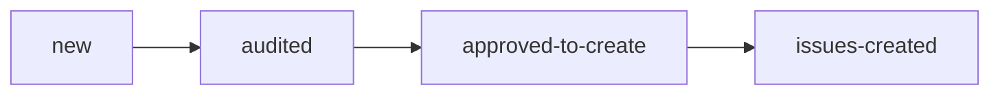

**Status:** scaffolded · **Last updated:** 2026-04-24

## Purpose

`audit` is the upstream module for a **known repo with unclear readiness or unclear work queue**.

It answers:

- what blocks launch or client handoff?
- which gaps are execution-ready?
- which gaps still require a human platform decision?
- what bounded issues should exist before `deliver` starts?
- what is exposed at the public production edge, if a URL is configured?

`audit` does **not** fix code in the same run.

## Lifecycle

This is a bounded loop, not a continuous crawler.

## Artifacts

All state lives under `.autoship/audits/<run-id>/`:

- `assessment.md` — auditor output
- `review.md` — audit-reviewer verdict
- `created-issues.json` — tracker issues materialized by the controller

## Agents

| Agent | Role |
|---|---|
| `autoship-controller` | Orchestrates the audit run, owns tracker mutations, stops at approved issue creation |
| `audit-auditor` | Produces the assessment plus issue candidates |
| `audit-reviewer` | Fresh-context skeptic for evidence, verdict thresholds, and issue-candidate quality |

## Standards and evidence

Audit uses this precedence:

1. `.autoship/standards.yaml` — policy
2. repo evidence — `.env.example`, CI files, deploy config, infra files, tests, docs
3. safe external exposure observations, when `external_exposure.enabled: true`
4. cheap verification commands
5. inference

If policy and evidence do not constrain the implementation path, the finding should become `decision-required`, not an invented stack choice.

## External exposure

Audit can optionally run a black-box external production exposure smoke test against the URL declared in `.autoship/program.md`.

This is not a UI walker and not a pentest. It checks public-edge readiness signals such as TLS, redirects, security and cache headers, CORS, public API auth gates, version leakage, robots/indexing, health/docs/debug endpoints, and explicitly configured login/session smoke checks.

Safety rules:

- default methods: `GET`, `HEAD`, `OPTIONS`
- login `POST` only when explicitly enabled
- no `DELETE`, `PUT`, `PATCH`, non-login `POST`, uploads, password reset, fuzzing, credential stuffing, or load testing
- if a safe read proves the issue, stop rather than mutating state
- redact sensitive response values

## Parallelism

Audit is serial by default at the agent boundary: one auditor writes `assessment.md`, then one reviewer judges it. Do not split into parallel specialist auditors until a probe shows the single assessment path is too slow or too shallow.

Inside the auditor, independent read-only checks can be batched or run concurrently when that does not blur evidence ownership. The output remains one assessment with one severity model.

## Handoff to deliver

The controller may create approved issue candidates in Linear or GitHub, but the default created state is `Backlog`.

That keeps the boundary clean:

- `audit` decides **what work should exist**
- `deliver` handles work only after it is later promoted into `Grooming`
