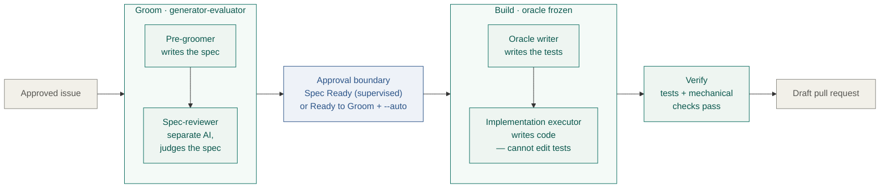
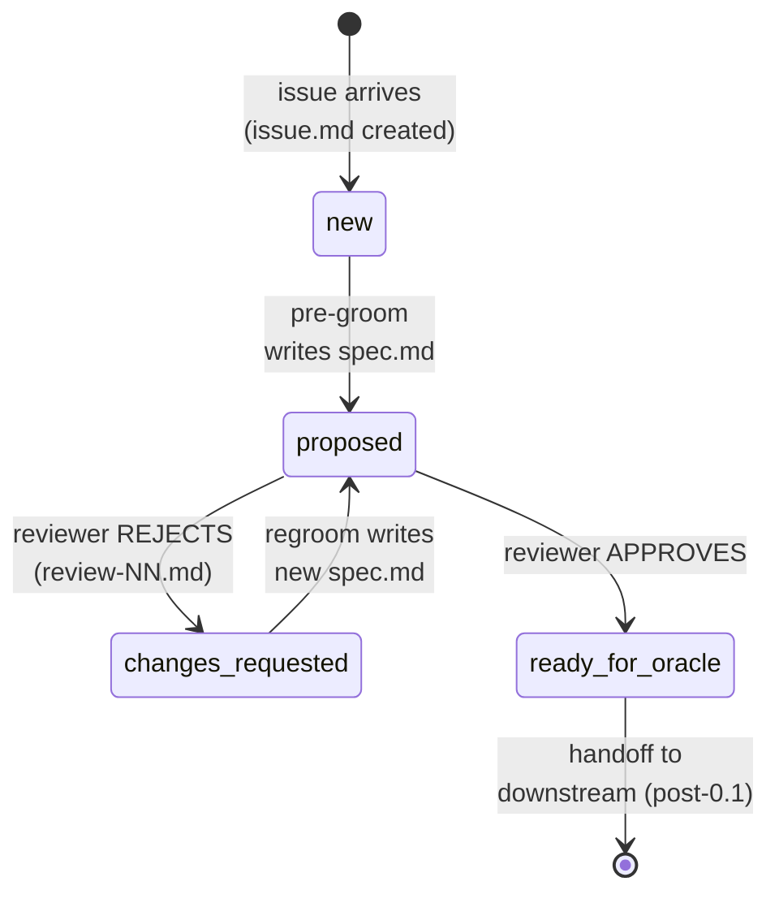
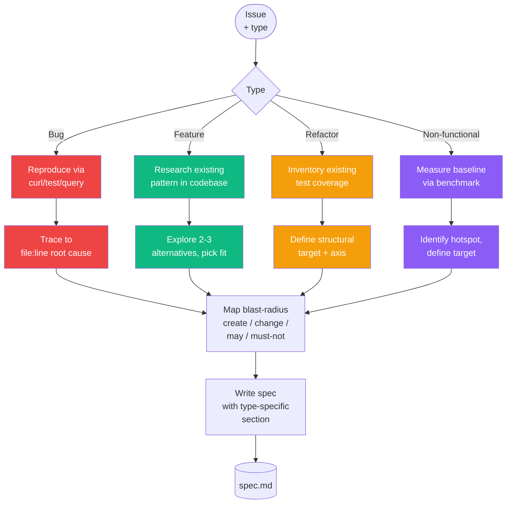
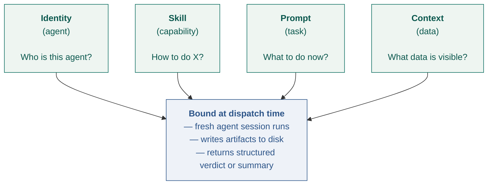
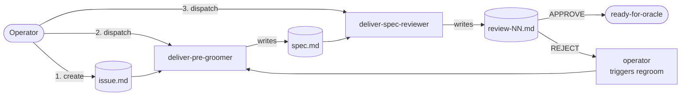

**Status:** Operational · **Last updated:** 2026-04-29

> **Implementation status.** The grooming → review → spec, build → oracle → implementation → verification, and draft-PR phases are operational and validated across Bug, Feature, Refactor, and UI-build shapes. Merge, deploy, and outcome verification (the `validate` module) remain future work. Sections labeled "Considered and deferred" are aspirational; everything else describes shipped behavior.

## In plain English

You have an existing codebase and an approved ticket — a bug to fix, a feature to add, a refactor to land. You want the change written, tested, and reviewable — without losing control of what changed or why.

Asking an AI to *"just implement the ticket"* tends to produce code that looks right but drifts the scope: changes files that weren't supposed to move, adds tests that don't pin the real behavior, or silently reinterprets what the ticket was asking for.

**Deliver** takes an approved ticket and produces:

- A **spec** — a plain-English plan for the change, written by AI and reviewed by a separate AI reviewer before any code is written. If the spec is weak, work doesn't start.
- A **draft pull request** with the code change, the tests, and the evidence that the change actually works.

In supervised mode, grooming can park the issue in `Spec Ready` and hand the baton back to the human. In the recommended remote mode, `Ready to Groom` is the explicit consent state: Autoship grooms, opens/updates the durable PR envelope, and continues into build when the spec reviewer approves and validation is available. Umbrella issues route to a reviewed `[Breakdown]` PR; `Breakdown Approved` creates child issues and starts only dependency-free slices. Any blocker lands in `Needs Attention`.

> **The rest of this page is engineering detail.** Leadership readers can stop here and head to the [System overview](/architecture/system-overview/) or [What we've learned](/learnings/).
>
> **Key terms used below.** **Spec** — the plain-English plan for the change. **Oracle** — the test suite that judges whether the code is done; the author of the code cannot edit it. **Oracle writer / Implementation executor** — two separate agent sessions: one writes the oracle, the other writes the code. **Pre-groomer / Spec-reviewer** — the two agents that write and judge the spec respectively.

## Problem

The retired extract research track explored the *"unknown prototype"* problem. `deliver` solves a different problem: *"known repo, known issue, controlled change."*

For an existing project, the challenge is different:

- the codebase already exists
- the issue is usually narrower than a full product spec
- regression risk matters more than discovery breadth
- the execution system needs stronger state, recovery, and verification discipline than a one-off prompt loop

The goal of `deliver` is not to reverse-engineer the whole product again. The goal is to take a bounded change request, produce a trustworthy change spec, and drive it through build and validation without losing control of scope or evidence.

## Architecture Overview

`deliver` is an autonomous change pipeline built around an external state machine. Canonical state lives on disk. Each unit runs in a fresh context window. Evidence anchors every transition. A separate reviewer judges the author's work at every structural handoff.

`deliver` is the **delivery-layer** module, not the whole future product workflow. Upstream concerns like intent capture, enrichment, prioritization, and decomposition may exist elsewhere in autoship later. For now, they appear only in the limited ways needed to produce a trustworthy change spec and move an approved work item toward build.

At the broader product level, those are better treated as **concerns** than one rigid global pipeline. Enrichment can recur during grooming, regroom, and later verification. Decomposition can happen during grooming or before a work item enters `deliver`. `deliver` itself remains a **small explicit workflow**.

Operator experience should stay pragmatic. A tracker like Linear is the likely **outer workflow surface** for humans: status, comments, lineage, priority, and linked issues. Repo-local artifacts remain the **inner execution contract** for agents — they version with code, freeze review inputs, and keep the machine-facing spec, test suite, and evidence stable.

### What deliver owns

Deliver zooms into the operational middle of the [system end-to-end flow](/architecture/system-overview/#end-to-end-flow): from an approved issue to a reviewed draft pull request. The shape is two generator-evaluator pairs with an explicit spec approval boundary between them. That approval can be a human action in supervised mode or an explicit `--auto` run policy plus reviewer APPROVED verdict in remote automatic mode.



The same structural discipline shows up at both stages:

- **Grooming** — one AI writes the spec, a *separate* AI judges it. The author never grades its own homework.
- **Building** — the oracle writer creates the tests. The implementation executor writes the code, and it is **forbidden** from modifying the tests. The oracle-freeze plays the role of the separate reviewer; test mutation becomes a visible signal that something's wrong.

When review rejects, work loops back: Spec-reviewer REJECT sends the pre-groomer back to rewrite the spec; a Verify failure sends the implementation executor back to fix the code. Merge, deploy, and outcome verification sit **outside** deliver's scope — they belong to the system-level flow and (when they land) the `validate` module.

**Current probe scope.** Probe 0.1 proved the grooming half (Pre-groomer + Spec-reviewer). Probes 0.2–0.5 extended through the building half (oracle + implementation + verification) and across Bug, Feature, Refactor, and UI-build shapes. Draft-PR handoff is operational today.

### Load-bearing architectural choices

- **Evidence-first artifacts** — truth comes from code, data, and observed behavior, not from issue text
- **Oracle quality as the ceiling** — the *oracle* is the test suite that judges whether a change is done. The executor optimizes for whatever the oracle measures, so weak tests produce "code that passes tests but doesn't work."
- **Generator-evaluator separation at every handoff** — the author never discharges the gates judging its own work
- **Fresh session per unit** — context accumulation silently degrades output quality
- **Disk-backed execution state** — state lives on disk, not in a long-running session
- **Strict unit sizing** — every unit must fit in one context window
- **Mechanical verification gates** — no judgment-only transitions in the outer loop
- **Isolation and recovery discipline** — autonomous work runs in branches or worktrees, with explicit stuck detection

## Lifecycle and State Machine

### Issue state machine (0.1 scope)

State is derived from filesystem presence — no parallel state file. Reviews are append-only (new file per pass); specs overwrite (git log preserves history).



### State determination from filesystem

| Filesystem condition | State |
|---|---|
| `issue.md` exists, no `spec.md` | `new` |
| `spec.md` exists, no `reviews/` | `proposed` |
| latest `reviews/review-NN.md` verdict is REJECTED | `changes-requested` |
| latest `reviews/review-NN.md` verdict is APPROVED | `ready-for-oracle` |

### Outer state: state-as-baton handoff

The inner filesystem state machine is the agents' source of truth. The outer Linear workflow-state column is the **human-facing baton**: a card in `In Progress` means autoship is currently working it; a card anywhere else means it's the operator's turn.

Four recommended operator-created states extend Linear's universal set (`Todo` / `In Progress` / `In Review`):

- **`Ready to Groom`** — type `unstarted`. Remote runners use this as explicit automation consent for one issue. `Todo` remains a human/local grooming bucket, not a webhook trigger.
- **`Breakdown Proposed`** — type `unstarted`. Signals "umbrella breakdown reviewed; your turn to review the `[Breakdown]` PR."
- **`Breakdown Approved`** — type `unstarted`. Signals "create child issues and start dependency-free slices."
- **`Needs Attention`** — type `unstarted`, parallel column. Signals "autoship halted on a typed blocker; your turn to unblock."

`Spec Ready` remains supported for supervised/manual installations but is no longer part of the default remote happy path.

The controller is the single writer to Linear when posting is enabled. At each posted milestone it fires both a best-effort state change and a comment with @mention of the assignee — the state change is the kanban-glance baton, the comment is the Inbox notification. The canonical transition table:

| Milestone | Linear state | Comment payload |
|---|---|---|
| autoship picks up an issue (groom phase) | `In Progress` | `Autoship grooming started.` |
| grooming complete, spec APPROVED (bounded, supervised) | optional `Spec Ready` | `Spec written: <type>, <status>[, N Assumptions]. See .autoship/issues/<id>/spec.md. Run \`autoship deliver <id>\` to build.` (with @mention) |
| automatic spec PR opens (bounded) | no required state change | `Spec PR ready: <url>. Autoship is continuing because the issue was triggered from Ready to Groom with \`--auto\`.` |
| grooming complete, breakdown APPROVED (umbrella) | `Breakdown Proposed` | `Breakdown proposed: N slices. Review the draft \`[Breakdown]\` PR, then move the parent to \`Breakdown Approved\` or run \`autoship create-issues <id>\` to create child issues and start dependency-free slices.` (with @mention) |
| create-issues complete (full success) | `In Progress` then `Decomposed` label/convention | `Created N child issues. Started X dependency-free child issue(s) by moving them to Ready to Groom; Y child issue(s) are waiting on dependencies. PR closed.` |
| create-issues partial / retryable | `Breakdown Proposed` (unchanged) | `Child issue creation partial: created N of M, pending P. Re-run \`autoship create-issues <id>\` or move back to Breakdown Approved after fixing the retryable cause.` |
| grooming hit blocker (`needs-human-input`) | `Needs Attention` | `Halted during groom — <reason>. See .autoship/issues/<id>/<artifact>.` (with @mention) |
| build starts (`autoship deliver <id>`) | `In Progress` | `Build started — branch <branch>, worktree <path>.` |
| draft PR opens | `In Review` | `Draft PR: <url>. Validation: passed. Branch: <branch>. Review the PR's Human Review Checklist before merge.` |
| build hit blocker | `Needs Attention` | `Halted during build — <reason>. See .autoship/issues/<id>/<artifact>.` (with @mention) |

State names are configurable via `transitions.{working,spec_ready,breakdown_proposed,blocked,pr_open}` in `.autoship/defaults.yaml`; the runner's trigger states are configured separately and default to `Ready to Groom` and `Breakdown Approved`. Defaults assume the four recommended states above have been created in the Linear workspace; if a target state is missing, the controller posts the comment and skips the state change rather than failing the run. The repo-local mirror and, in remote automatic mode, the draft PR branch are the execution contract — comments carry one-line summaries and links, not full specs.

Build PRs are review packets, not just implementation diffs. A completed build PR includes a `Human Review Checklist` with issue-specific inspection points, validation gaps or manual checks, and risk areas. For UI/frontend changes, the checklist names the visual state to inspect and includes screenshot or preview evidence when available; if evidence is unavailable, the PR says so plainly.

Local runs are local-first. `--post` opts into Linear comments and best-effort state transitions; remote runners may pass `--post` as policy. The canonical Linear policy lives in `.claude/agents/autoship-controller.md § Linear policy`.

### Per-type grooming flow

All four types share the same overall shape: `read issue → apply type-specific procedure → map blast-radius → write spec → review`. The type-specific middle differs per type because the truth source differs.



### Feedback loops

`deliver` is not a linear chain — it's a DAG with explicit feedback edges:

- **Regroom** — reviewer REJECTS a spec → pre-groomer re-grooms from updated inputs. Same issue, new spec; prior review preserved in `reviews/review-NN.md` history.
- **Re-plan** (future) — oracle-reviewer REJECTS oracle plan → oracle-planner re-plans.
- **Rebuild** (future) — walker or post-build reviewer REJECTS → builder re-dispatches with revised plan.
- **Rollback + new issue** (future) — monitor detects regression → auto-rollback + new issue created for investigation.

Every transition either advances state or writes a reviewer verdict explaining why it did not. The state machine never goes silently stuck.

## Preconditions

Deliver is an automation pipeline built on top of a running codebase. The full pipeline — grooming → oracle → build → verify → close — operates meaningfully only when the testbed meets a small set of preconditions:

- **Test infrastructure** — a runnable test command, functional tests covering observable behavior, deterministic, reasonably fast (minutes not hours)
- **Reproducible environment** — seedable database, consistent fixtures, runnable locally or in CI
- **Clean version control** — git with a stable main branch to anchor against

These apply to the full pipeline, not to probe-0.1 specifically. Probe-0.1's grooming stage produces specs that *reference* tests (Acceptance Criteria verifications and Refactor's Preservation Proof); it does not execute them. A testbed with thin tests can host grooming — it becomes a blocker at oracle and build stages in later probes.

When preconditions are not met, the fix is itself a change. Adding tests, seeding fixtures, or stabilizing CI is a precursor issue that deliver can groom and drive like any other.

## Issue Types

`deliver` recognizes four types, distinguished by the shape of grooming each requires — specifically, where the truth lives and how it is found.

| Type | Grooming shape | Truth location | Posture |
|---|---|---|---|
| **Bug** | Forensic | Latent in code: reproduce → root cause → fix | Observe, diagnose, specify |
| **Feature** | Generative | Has to be invented: research → design → alternatives → pick | Find smallest design that fits existing patterns |
| **Non-functional** | Measured | In benchmarks/metrics: baseline → target → approach | Observe a number, not an error (deferred design) |
| **Refactor** | Structural | Code-quality criteria: define "better" → bound scope → preserve behavior | Preserve behavior, improve structure |

Each type has a materially different grooming shape. Two types with the same shape should be one type.

### Types are classifications, not pipelines

For v0.1, one pre-groomer + one spec-reviewer handle all four types. Type is a field on the spec. Type-specific optional sections carry the shape differences:

- **Bug** — Reproduction Steps, Root Cause
- **Feature** — Design Rationale (alternatives considered, picked design, reasoning)
- **Non-functional** — Baseline Measurement, Target (deferred to probe-0.2+)
- **Refactor** — Behavior Preservation (how we know nothing changed)

Specializing into four separate grooming pipelines is deferred until observed quality justifies it. Structure before evidence is formalism, same discipline applied to `calibration/` and supervisor modules.

### Out of scope for `deliver`

Explicitly not handled by this module:

- **Spikes and research tickets** — produce knowledge, not code
- **Strategic planning** — "should we rewrite X in Y?" is not a change request
- **Multi-repo coordination** — `deliver` is single-repo by design
- **Standalone documentation updates** — doc changes bundled with a code change are part of the parent type; pure doc changes may get their own probe later

## Empirical Validation

Autoship's own probe series already surfaced the failure shapes this architecture must handle.

Historical extract probes 2.2 → 2.3 → 2.4 ran the same loop three times: observe failure → add a forcing-function gate → the controller absorbs the gate while reproducing the failure under a new label. The structural cause was that the author of the plan also discharged the gates judging it. Accumulating gates at the author boundary does not fix author-is-judge; it renames the failure.

Historical extract probe 2.5 validated the structural fix. A fresh-context plan reviewer with a calibration set caught four substantive failures on its first pass (one-journey-per-slice violation, deferred-action affordance, duplication across handoff artifacts, consistency drift). The build then shipped clean — 14/14 journey walks pass end-to-end on seeded data, 145/145 oracle green, zero operator intervention. Reviewer cost was under 2% of the probe total.

`deliver` applies the same generator-evaluator pattern at a different stage. The planning-layer fix generalizes; the failure modes are structural, not probe-specific. See `docs/learnings.md` for the live synthesis; archived extract detail lives under `docs/archive/extract/`.

## Foundations

These are the architectural decisions load-bearing enough to use in `deliver-0.1`.

### 1. Disk-Backed Execution State

The controller reads and writes canonical state on disk, not in a long-running in-memory session.

Why:

- crash recovery becomes straightforward
- resumability is real, not aspirational
- human steering and agent execution share the same source of truth
- execution state versions with the repo

For `deliver-0.1`, keep this minimal:

```text
.autoship/issues/<id>/
  spec.md
  reviews/
    review-01.md
    review-02.md
```

State is derived from filesystem presence — no parallel state file. Reviews are append-only (new file per pass); specs overwrite (git log preserves history).

### 2. Fresh Session Per Unit

Every major unit runs in a fresh context window.

Initial units:

- `pre-groom`
- `review`
- `regroom`
- optional `oracle-draft`

Fresh context is a structural advantage. Probes 1 through 2.5 all used fresh-session-per-unit and none surfaced a state-management bug caused by it.

### 3. Hard Unit Sizing

A unit must fit in one context window.

If a grooming pass needs more context than fits, split it into smaller units:

- codebase scan
- baseline snapshot
- oracle draft

This prevents oversized sessions that silently degrade in quality.

### 4. Explicit State Machine

The workflow is explicit from day one:

- `new`
- `proposed`
- `changes-requested`
- `ready-for-oracle`

Small enough to support pre-groom, review, and regroom without importing a full milestone engine. See the "Lifecycle and State Machine" section above for the full state diagram.

### 5. Mechanical Gates

No judgment-only transitions in the outer loop. At minimum:

- `spec.md` exists
- required spec sections are present
- `reviews/review-NN.md` contains a parseable verdict
- state is derivable from filesystem presence — no parallel state store to drift

The first probe must be able to fail mechanically, not only subjectively. Mechanical → grep; judgment → reviewer (see CLAUDE.md §Project Philosophy).

### 6. Repo-Local Canonical State With Optional Tracker Sync

External trackers provide the outer workflow surface. They do not hold execution state.

Trackers own:

- intake
- visibility
- approval
- coarse workflow state

Repo-local artifacts own:

- machine-readable spec state
- retry and recovery data
- reviewer verdicts
- execution truth

### 7. Spec Schema

`spec.md` has seven base fields, one optional universal field, and one type-specific section.

**Schema tree:**

```
spec.md
│
├── [Frontmatter]
│   ├── issue, issue-rev, groomed-at, trigger, type
│   └── type-specific status:
│       ├── Bug            → reproduction-status
│       ├── Feature        → design-status
│       └── Refactor       → preservation-status
│
├── [Base fields — all types]
│   ├── Outcome                         (one-line user-visible result)
│   ├── Acceptance Criteria             (runnable predicates)
│   ├── Scope Fence                     (Always / Ask / Never)
│   ├── Rabbit-Hole Patches             (pre-answered decisions)
│   ├── Blast-Radius Manifest           (Create / Change / May / Must-not)
│   ├── Skeleton Position               (single-slice vs multi-slice)
│   └── Concrete Example                (input/output or reference)
│
├── [Optional universal]
│   └── Failure Modes                   (runtime risk scenarios)
│
└── [Type-specific section — exactly one of:]
    ├── Bug            → Reproduction Steps + Root Cause
    ├── Feature        → Design Rationale (menu below)
    ├── Refactor       → Behavior Preservation (three subsections)
    └── Non-functional → Baseline Measurement + Target (deferred)
```

**Base fields detail:**

- **Outcome** — one-line user-visible result
- **Acceptance Criteria** — atomic verifiable predicates, each mapping to a runnable check (test command, grep, Playwright assertion)
- **Scope Fence** — Always / Ask / Never tiers, with Never naming specific files or directories
- **Rabbit-Hole Patches** — pre-answered decisions for uncertainties the executor would otherwise guess
- **Blast-Radius Manifest** — four buckets: `Expected to create`, `Expected to change`, `May change`, `Must not change`. All derived from the codebase.
- **Skeleton Position** — single-slice (first or N+1, naming the pattern it follows) OR multi-slice feature (oracle-plan decomposes)
- **Concrete Example** — input/output, sample data, or screenshot that fixes interpretation

**Optional universal field:**

- **Failure Modes** — populated when the change has runtime risk (external dependencies, queued jobs, state mutation, non-trivial errors). Bug specs may omit; Feature specs with async or stateful work should fill.

**Behavior Preservation (Refactor only).** Three subsections:

- **What must be preserved** — observable invariants (API response shapes, status codes, DB row shapes, emitted events, side effects) + non-observable behaviors that matter (performance characteristics, ordering)
- **Preservation Proof** — existing tests that cover the refactor target (grep-verifiable list, not line coverage) + identified gaps + specific regression tests the spec commits to adding BEFORE the refactor lands + runnable verification command
- **Structure Improvement** — before → after structural shape, improvement axis (coupling / readability / testability / complexity / performance / security), measurable criterion for "done"

Refactor may also include `Design Rationale` when ≥2 structural approaches exist (split god-class N ways). For trivial refactors (rename a function), Design Rationale is skipped — one approach, no alternatives to weigh.

**Design Rationale menu (Feature only).** Pre-groomer includes subsections that match the feature's characteristics. Not all subsections apply to every feature — including irrelevant ones is noise, omitting relevant ones is grounds for REJECT.

- **Alternatives** (always) — 2–3 approaches with cost + fit + tradeoff, citing real `file:line` patterns
- **Picked + Reason** (always) — which one, why, favoring simplicity + fit over novelty
- **Constraints** (when runtime/infra shape) — load profile, timeout envelope, resource limits, concurrency
- **Migration Plan** (when schema changes) — DDL sequence, online-safety, backfill strategy
- **Backward Compatibility** (when changing APIs or data) — old rows / clients / shapes that must survive
- **Rollback Plan** (when risky) — how to undo
- **Schema Diff** (when DB change) — columns, types, defaults, indexes
- **Deferred** (always optional) — alternatives explicitly not pursued, for future reference

Mechanical content (acceptance criteria, blast-radius manifest, subsection presence) is grep-checkable. Judgment content (scope fence, rabbit-hole patches, picked alternative) is what the reviewer evaluates.

### 8. Voice-Coded Anti-Pattern Framing In Prompts

Every agent prompt carries a short adversarial section — specific failure modes to avoid, written in a voice the agent can internalize rather than a checklist to tick off.

Thicker than a principle list; lighter than a rubric. Calls out the shape of failure: "do not ship affordances without effects; do not mark a task done because the code compiles; do not cut scope and relabel it as `blocked-other`."

Applies across the pipeline — pre-groomer, spec-reviewer, later the builder and post-build reviewer — with anti-pattern content specific to each role.

### 9. Pre-Inject Context In Dispatch Prompts

The dispatch prompt for each unit inlines all the context that unit needs:

- for `pre-groom` — issue body, relevant code excerpts, recent commits, test summaries
- for `spec-reviewer` — the spec, the issue, relevant code, any prior review verdicts
- for later stages — their own specific inputs

The agent is told explicitly what it has been given and what it has not. This avoids burning the first ten tool calls re-orienting to context the dispatcher already has, and prevents the agent from fishing outside the intended scope.

## Agents in this module

Five specialized agents participate in a deliver run. The controller dispatches them in order; each receives a fresh context window with exactly the artifacts it needs.

| Agent | Role | Owns | Judged by |
|---|---|---|---|
| **Controller** (deliver mode) | Orchestrator. Resolves the RunRequest from flags or NL prompt (with per-repo stickies from `.autoship/defaults.yaml`), selects eligible work, dispatches each agent, and owns all tracker mutations. | Orchestration state and tracker updates. No code, no specs. | The human, via the eventual draft pull request and the tracker state. |
| **Pre-groomer** | Writes the **spec** — the plain-English plan — from the raw issue. | `spec.md` in the run directory. Populates every base field in the schema. | Spec-reviewer (separate agent). Never grades its own output. |
| **Spec-reviewer** | Judges whether the spec is well-formed, grounded in the codebase, and well-scoped. Returns `APPROVED` or `REJECTED` with specific objections. | `reviews/review-NN.md` — append-only, one file per pass. | The operator, indirectly, through the calibration set grown from observed overrides. |
| **Oracle writer** | Writes the **oracle** — the test suite that will judge the code — from the approved spec. | Tests only. The spec is read-only; the codebase is read-only; no source code is edited. Owns `oracle/result.md`. | Implementation executor (tests pass once code is written, or don't) and the human reviewer on the PR. |
| **Implementation executor** | Writes the code change against the frozen oracle. | Application source code only. **Forbidden** from editing tests, the spec, or any oracle artifact. Owns `implementation/result.md`. | The oracle — implementation cannot silently weaken tests to shortcut the change. Test mutation is a visible failure signal. |

The shape is serial and disciplined: outputs of one agent become read-only inputs of the next. Nothing loops back except through an explicit reviewer verdict (spec-reviewer rejects → regroom) or a mechanical test failure (oracle fails → implementation rewrites the code).

## Agent Contract

Every agent invocation in `deliver` binds four explicit contracts. Each answers a distinct question and carries its own design decisions.

### The four layers

Four contracts converge into a single dispatched agent session:



Each layer's design decisions in one place:

| Layer | Answers | Design decisions |
|---|---|---|
| **Identity** (agent) | Who this agent IS | Role, posture, system prompt, default tools, model/effort |
| **Skill** (capability) | HOW to do X | Procedure, inputs/outputs, required tools, reusability across agents |
| **Prompt** (task) | WHAT to do now | Which identity, which skills, specific task, completion criteria |
| **Context** (data) | WHAT data the session sees | What's pre-injected, what's tool-accessible, what's explicitly NOT available, what's fresh vs. carried |

### Context as first-class

Leaving context as "whatever the session drags in via tool calls" is the default failure mode — agents waste turns re-orienting, hallucinate because pre-injection was silently incomplete, or drift because they fish through files outside intended scope.

Every load-bearing probe lesson has been about context: fresh context per unit, pre-inject context in dispatch, tell the agent what it does NOT see. Making context explicit in the contract forces each agent definition to declare what it gets, what it does not, and why. See Foundations §2 (fresh session per unit) and §9 (pre-inject context).

### Extending the system

Three rules govern how the contract grows:

- **Extend capability with skills.** When an agent needs a new procedure (reproduce a UI bug, map blast-radius, write a regression test), add a skill — not a new agent and not a longer system prompt.
- **Extend orchestration with the controller.** When a task needs a different role or fresh context, add a controller-dispatched step, not a direct agent-to-agent invocation.
- **Never let context be accidental.** Every dispatch prompt declares what context is pre-injected and what the agent is allowed to discover via tools.

### Agents do not invoke agents directly

Consistent with autoship's established pattern, leaf agents never dispatch other leaf agents. If `pre-groomer` needs information beyond its current task scope, it either:

1. Invokes a skill in-session — most cases, including browser automation, DB query, test run, grep over the codebase.
2. Outputs a structured signal to the controller (`status: needs-exploration`, with target parameters). The controller dispatches a specialized agent with fresh context and feeds results back on the next `pre-groomer` dispatch.

This preserves fresh-context-per-unit, keeps the single-writer invariant on disk state, and makes every transition observable by the controller.

## Post-0.1 Extensions

Strong architectural choices that are not required to prove `deliver-0.1`. Add them when the observed failure justifies the complexity.

### 1. Branch or Worktree Isolation

Autonomous work is safer when isolated from the main working tree.

Introduce:

- per-issue branch isolation first
- worktree isolation soon after, if branch-only mode proves too fragile

Becomes load-bearing once `deliver` builds code rather than stopping at grooming.

### 2. Crash Recovery and Stuck Detection

Beyond grooming, the controller must detect:

- repeated failed retries
- missing expected artifacts
- blocked verification loops
- sessions that ended without a valid state transition

Required before long-running unattended build mode.

### 3. Stronger Verification Artifacts

After build lands, write richer evidence than pass/fail text:

- verification JSON
- walker result artifacts
- reviewer decision records
- baseline vs changed-surface summaries

Supports both recovery and learning capture.

### 4. Persistent Learnings

Closed issues feed back into durable project memory:

- `decisions.md`
- `learnings.md`
- later, formal calibration if repeated patterns justify it

`deliver-0.1` does not pre-create an empty `calibration/` directory for appearance. Calibration is born from observed operator overrides, not invented upfront.

### 5. Tracker Adapters

Tracker integration arrives after the repo-local execution model is stable.

Adapters handle:

- syncing coarse issue state
- mirroring review outcomes
- opening branches/PRs

Adapters do not define the architecture.

### 6. Model And Complexity Routing

Route per unit type:

- heavy (Opus-tier) for planning, replanning, grooming
- standard (Sonnet-tier) for execution
- light (Haiku-tier) for triage-level judgments

Reasoning and coding weights are separable — planning is reasoning-dominant; execution leans on coding fluency. Budget-pressure downgrades can trigger at graduated thresholds.

Autoship tracks cost today but does not route on it. Once `deliver` runs continuously against a real repo, this becomes load-bearing — both for economics and for matching model strength to task shape.

### 7. Multi-Reviewer Council At Post-Build Validation

The review stage dispatches multiple parallel fresh-context reviewers with distinct rubrics:

- Requirements Coverage — does the change deliver the acceptance criteria?
- Cross-Slice Integration — does it compose with surrounding work without regressions?
- Acceptance Criteria — are the runnable checks actually exercising the change?

Aggregate verdict rule: any FAIL → `needs-remediation`. Each reviewer catches a different failure shape; a single monolithic reviewer tends to smooth over one kind of failure while fixating on another.

Extends the same generator-evaluator pattern validated in the archived extract research track to a later stage, with role-specialized reviewers.

### 8. Controller Support For Runtime Orchestration

The controller-backed runtime extends `deliver` into the first end-to-end path that reaches **draft PR**. One top-level `autoship-controller` agent running in `deliver` mode now owns both halves of the workflow:

- supervised grooming path: human prompt/query → preview → pre-groom → spec review → regroom → local spec parked at `Spec Ready` (or `Needs Attention` on blocker). Preview is informational by default; per-repo `deliver.confirm: true` turns it into a `[y/N]` boundary.
- supervised build path: explicit `autoship deliver <id>` approval or strict `states.build` eligibility → worktree + branch → oracle → implementation → verification → draft PR → `In Review`
- automatic path: `autoship deliver <id> --unattended --auto` from a trusted runner handoff → groom/review → commit spec ledger + `manifest.json` to the issue branch → open/update a spec-first draft PR → continue to build only when the reviewed spec is build-worthy and validation is available

Input is a **RunRequest** normalized from the trigger (CLI flags, natural-language prompt, or runner webhook handoff) — see `.claude/agents/autoship-controller.md § How I Receive Work`. The RunRequest names the testbed, issue source, groom/build state policy, `--post`, `--yes`, `--unattended`, `--auto`, validation commands, and outer state map. Source, Linear scope, and validation commands are **inferred from repo evidence** when not explicitly set in `defaults.yaml`; each inference writes one structured record to `runs/<run-id>/inferences.jsonl` (schema: [decision-log.md](docs/architecture/decision-log.md)) and is surfaced in a human-readable announce block at run start. In remote automatic mode the runner handoff supplies selection authority for the one issue, but the controller still owns execution authority and must stop before code changes if validation is missing or ambiguous. Fresh context per sub-agent dispatch; state on disk; single-writer invariant preserved.

The controller reads two distinct instruction layers:

- **`.claude/agents/autoship-controller.md`**
  Stable autoship operating knowledge plus per-mode procedure: workflow semantics, approval boundaries, meaning of `needs-human-input`, reviewer/generator separation, default stop conditions, and the deliver-mode loop itself. Also hosts § How I Receive Work, which defines the RunRequest contract and configuration precedence.

- **RunRequest** (in-memory per run, snapshotted to `<run-dir>/run.json`)
  Run-scoped contract: which repo/testbed to operate on, which issue source to pull from (`deliver.linear` or `deliver.folder`), which states are eligible for grooming vs build, whether the run is unattended, whether automatic groom-then-build is authorized, whether Linear mirroring is enabled, and what "do not stop" means for this specific run. Resolved from: trigger flags → `.autoship/defaults.yaml` → **runtime inference from repo evidence** (`linear auth list`, `package.json`, `Makefile`, etc.) → framework defaults. Inference fires only when the higher-precedence layers do not set the field; each fired inference writes to `inferences.jsonl`. `defaults.yaml` is therefore **optional override** rather than required setup.

This split keeps stable framework knowledge from turning into a junk drawer for repo-specific or one-off policy. (The framework knowledge previously lived in a separate `autoship-controller` skill; it was folded into the agent file on 2026-04-24 because the skill had a single reader and the split was creating drift between two files. Historical note: the trigger contract was originally a committed `.autoship/program.md` file; current deliver does not read it and uses flag/NL triggers instead.)

These files are **controller-only**. Manual worker dispatch remains a fallback path; it does not require them.

When `deliver` is connected to an external tracker, the controller is the only runtime actor that should mutate tracker state. Leaf workers (`deliver-pre-groomer`, `deliver-spec-reviewer`, `deliver-decomposition-reviewer`, oracle/build/review workers) should:

- write their own artifacts
- return a structured result to the controller
- never call the tracker's API/MCP directly for official state changes

That structured result acts like a callback signal to the controller:

- `spec-written`
- `verdict: APPROVED | REJECTED`
- `build-passed`
- `build-failed`
- `needs-human-input`

The controller then:

- posts the human-facing summary comment
- changes tracker status if policy allows
- dispatches the next worker or stops

### Human / agent handoffs in `deliver`

The core handoff boundaries should stay explicit:

1. **Human -> agent**
   An issue is created or selected in the outer workflow surface (a tracker) and becomes eligible for grooming.

2. **Agent -> human or reviewer-agent**
   After grooming, the agent writes the spec and review evidence, then hands off at `ready-for-oracle` or `needs-human-input`. When Linear is the outer surface, `ready-for-oracle` maps to `Spec Ready` and `needs-human-input` maps to `Needs Attention`.

3. **Approval boundary**
   In supervised mode, a human promotes work out of `Spec Ready` by running `autoship deliver <id>`; the controller transitions the issue to `In Progress` and dispatches the build half.
   In automatic mode, `--auto` plus an APPROVED spec review is the explicit authorization to continue into build for one issue. In unattended build-only mode, the controller advances eligible issues from configured `states.build`. Both stop at `Needs Attention` on any typed blocker.

4. **Agent -> review**
   After build/validation/PR creation, the agent hands off again at review/merge boundaries.

The rule is: agents do execution work; humans or reviewer-agents approve transitions that spend meaningful compute, widen blast-radius, or create external commitments.

Sub-decisions still deferred:

- **Dispatch mechanism** — subprocess (`claude --agent X -p "..."`) or Agent tool (in-session dispatch). Default to subprocess until the native controller wrapper exists.
- **Issue intake breadth** — operator pre-populates `.autoship/issues/<id>/issue.md`, or controller pulls from tracker API. The current runtime supports both local folders and tracker pull; broader multi-source intake is later.

GSD-style supervisor accumulation stays rejected — see Anti-Pattern 5.

### Current runtime and next candidates

Current implemented runtime:

- select issue (controller transitions to `In Progress`)
- pre-groom
- spec review
- regroom up to limit
- park at `Spec Ready` (or `Needs Attention` on blocker), or in automatic mode commit the spec ledger and open/update a spec-first draft PR
- write `manifest.json` for PR-envelope runs so later phases can verify issue, phase, base SHA, branch/PR, and artifact hashes
- after explicit `autoship deliver <id>` approval, strict build-state eligibility, or approved `--auto` spec review: controller transitions to `In Progress`, creates worktree + branch
- oracle result
- implementation result
- controller reruns validation
- controller commits, pushes, and opens or updates the draft PR
- issue moves to `In Review`

Explicitly not yet implemented in the current runtime:

- merge orchestration
- deploy orchestration
- post-deploy monitoring
- outcome verification against business/product success criteria
- parallel builds
- broad unattended promotion from natural-language scope

Next placeholders:

- **Next**: review + merge lane
- **Later**:
  - deploy + monitor
  - outcome verification
  - parallelism once the serial path is boring

## Anti-Patterns

Patterns `deliver` explicitly does NOT adopt.

### 1. Issue-First Truth Model

Autoship's differentiator is evidence-first reasoning.

For the retired extract research track, truth came from journeys, screenshots, sample data, observed behavior, and oracle coverage.

For `deliver`, truth comes from: current codebase reality, baseline snapshot, change spec, oracle draft, reviewer-approved decisions.

An issue tracker is an input and coordination surface, never the truth source. Issue text reflects what the reporter hoped; code reflects what the system does.

### 2. Replanning As Scope Escape Hatch

Self-judged gates get absorbed by the same agent that authored the plan. Probes 2.2 → 2.4 ran this failure three times, each time under a new label.

Any replanning in `deliver` must stay reviewer-controlled and evidence-constrained. The reviewer is the fixed point; the plan is negotiable. A controller that proposes to replan must produce evidence the reviewer can check, not rationale the reviewer has to trust.

### 3. Ceremony Before It Pays For Itself

`deliver-0.1` does not import milestone machinery, reporting layers, sync adapters, or recovery subsystems before the first grooming probe proves they are needed.

Each additional file is a surface for inconsistency — earn the separation. Three similar lines of code are better than a premature abstraction.

### 4. Static Gate Registries Without Calibration

Fresh-context reviewers are only useful when their rubric adapts from observed cases.

A static list of questions ("does this handle failure cases?", "is this secure?") with no override-feedback loop drifts from actual failure modes over time. The reviewer degrades into a checkbox machine that satisfies its rubric while missing the failure shape that matters.

Autoship's calibration methodology — operator overrides become new labeled cases, calibration grows over time — is load-bearing. It is what makes the reviewer's judgment transferable across probes and durable across time. The archived extract calibration set under `docs/archive/extract/plan-reviewer-calibration.md` is historical evidence for the pattern, not a live deliver rubric.

### 5. Accumulating Supervisor Modules

When a new failure mode appears, the fix is structural — move the check to the reviewer boundary — not a new supervisor module for every symptom (stuck-detection, timeout-recovery, verification-guard, ...).

Historical extract probes 2.2 → 2.4 demonstrated that each new gate layered on the author gets absorbed by the author. The reviewer is the fixed point against which structural fixes are made; supervisors are not. See `docs/learnings.md` for the live synthesis and `docs/archive/extract/harness-philosophy.md` for the archived research detail.

## Recommended 0.1 Shape

The first `deliver` probe stays narrow:



Five steps:

1. Pull issue or local change request context (operator creates `.autoship/issues/<id>/issue.md`)
2. Pre-groom a repo-local spec (`claude --agent deliver-pre-groomer -p "..."`)
3. Run reviewer verdict (`claude --agent deliver-spec-reviewer -p "..."`)
4. Optionally regroom if REJECTED
5. Stop at `ready-for-oracle`

No code built yet. Prove that the system can produce a trustworthy issue spec first.

### Filesystem layout

```text
autoship-deliver-0.1/
  app/                   # cloned testbed, pinned commit
    .autoship/
      issues/<id>/
        issue.md         # issue body + comments
        spec.md         # pre-groomer output
        reviews/
          review-01.md   # first reviewer verdict
          review-02.md   # after regroom (if any)
```

Per-issue artifacts live inside the testbed repo (`app/.autoship/issues/<id>/`) — the production shape where `deliver` gets installed into a repo the way `.github/` or `.claude/` does. Run-scoped state lives under `app/.autoship/runs/<run-id>/`: `run.json` (resolved RunRequest), `invocation.txt` (raw trigger), `decisions.log` (prose audit trail of state transitions and worker dispatches), and `inferences.jsonl` (structured record of every value the controller inferred at runtime — see [decision-log.md](docs/architecture/decision-log.md)). The optional active deliver pointer is `app/.autoship/runs/current`.

### 0.1-specific simplifications

Each graduates to a richer shape when observed need justifies it.

- **Controller scope stays staged.** Current runtime reaches draft PR, but still stops short of merge/deploy. The controller owns selection → pre-groom → review → spec parked at `Spec Ready` (or `Needs Attention` on blocker). Automatic mode may commit the spec ledger and open a spec-first draft PR before build. After explicit `autoship deliver <id>` approval, strict build-state eligibility, or approved `--auto` spec review: worktree → oracle → implementation → verification → draft PR update → `In Review`.
- **Shared reviewer discipline lives in one skill; rubrics stay domain-specific.** The spec schema, status enums, type postures, groundedness checks, and anti-patterns live in `deliver-grooming/SKILL.md` because both `deliver-pre-groomer` and `deliver-spec-reviewer` need them. Universal evaluator posture lives in `reviewing/SKILL.md`. The spec-specific reviewer checks live in `deliver-grooming/references/spec-review-rubric.md`.
- **State derived from artifacts.** `spec.md` exists → `proposed`; `reviews/review-NN.md` REJECTED → `changes-requested`; APPROVED → `ready-for-build`; `oracle/result.md` exists → `oracle-written`; `implementation/result.md` exists → `implemented`; `verification/result.md` passed → `ready-for-pr`. Remote automatic runs also write `manifest.json` as a machine-readable ledger with legal phases `grooming`, `spec_ready`, `needs_attention`, `building`, and `in_review`.
- **No calibration set at start.** `calibration/` directory is not created until the first operator override produces a real labeled case.
- **Reproduction outcome is a spec field, not a separate artifact.** A bug that cannot be reproduced is a `spec.md` with `reproduction-status: cannot-reproduce`; the reviewer's groundedness check flags it.
- **Non-functional type deferred.** Only Bug, Feature, and Refactor are designed; Non-functional grooming is implemented when probe-0.2+ has real data to inform it.

## Decision

For `deliver-0.1`, adopt the nine foundations. Defer the eight extensions. Explicitly reject the five anti-patterns.

**Foundations (in place):**

- disk-backed state
- fresh session per unit
- hard unit sizing
- explicit state machine
- mechanical gates
- repo-local canonical state
- spec schema
- voice-coded anti-pattern framing
- pre-injected dispatch context

**Post-0.1 extensions (deferred):**

- branch/worktree isolation
- crash recovery + stuck detection
- richer verification artifacts
- persistent learnings
- tracker adapters
- model and complexity routing
- multi-reviewer council
- controller agent for grooming orchestration

**Explicit anti-patterns (rejected):**

- issue-first truth model
- replanning as scope escape
- ceremony before it pays
- static gate registries
- accumulating supervisor modules

The resulting architecture is a bounded-change delivery engine where evidence anchors every transition, generator and judge are never the same agent, and state lives on disk.
