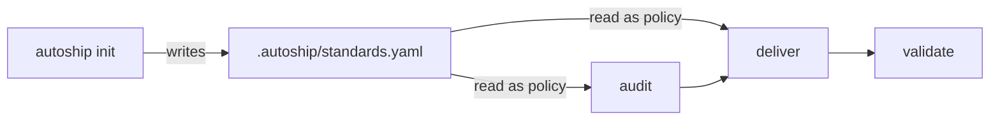

**Status:** Operational · **Last updated:** 2026-04-29

## In plain English

Autoship runs the middle of software delivery — the part between *"we need to understand or build X"* and *"X is reviewed, tested, and ready for a human decision."*

The live product has two runtime surfaces:

1. **Audit** — evidence-backed production readiness assessment that can create bounded issue candidates.
2. **Deliver** — issue-to-spec-to-oracle-to-implementation flow that ends at a draft pull request.

Both modes read repo policy from `.autoship/standards.yaml`, scaffolded by `autoship init` and owned by the operator after first install. Standards is setup config, not a runtime mode.

Validate remains future work. Extract is retired from the live product; its implementation and research notes are archived under `docs/archive/extract/`.

## Current Module Map

### Standards (setup artifact)

Handles the **repo policy bootstrap** problem.

`.autoship/standards.yaml` is owned by the `autoship init` CLI. On install, init walks repo evidence (package manifests, CI workflows, deploy config, migration tools, observability SDKs, async/queue libs, dependency-scan config) and fills high-confidence values directly into the YAML, annotating each with `# inferred from <evidence>`. Ambiguous values stay `SET_ME` and are treated as decision-required by audit.

Re-running `autoship init` on an existing `.autoship/` prints an advisory of fills and conflicts based on current evidence — it never modifies the file. Operators copy any fills they want into `standards.yaml` manually. autoship does not silently overwrite the file once it exists.

Standards are policy, not trigger config. They tell audit and deliver what the repo expects; they do not decide which run mode starts.

### Audit

Handles the **known repo, unclear readiness / unclear work queue** problem.

**Input:**
- production candidate or near-production repo
- launch / handoff / go-no-go context
- current deployment, CI, env, and operational setup

**Output:**
- an evidence-backed readiness report
- bounded issue candidates ranked `P0` / `P1` / `P2`
- optional Linear issues created in `Backlog`, ready to enter `deliver`

Audit may include a safe external exposure smoke test when the run provides `--external-url=<url>`. That covers public-edge readiness such as TLS, headers, CORS, public API auth gates, cache behavior, and debug/docs exposure. It must not run destructive probes.

Canonical docs:
- [audit-architecture.md](docs/architecture/audit-architecture.md)
- [audit-tracker-sync.md](docs/architecture/audit-tracker-sync.md)

### Deliver

Handles the **known repo, bounded change** problem.

**Input:**
- approved issue or local issue file
- existing codebase
- current tests and local conventions

**Output:**
- a trustworthy spec
- a frozen test oracle
- a validated code change, shipped as a draft pull request

Canonical doc: [deliver-architecture.md](docs/architecture/deliver-architecture.md)

### Validate

*Coming soon.*

Validate is the downstream bookend: after a change ships, check whether it actually moved the thing it claimed to.

## Agent Roster

Autoship runs on a small set of specialized agents. Each does one thing; the controller orchestrates them.

| Agent | Module | Role | Status |
|---|---|---|---|
| **autoship-controller** | Core | Resolves triggers into RunRequests, dispatches workers, owns tracker mutations. | Operational |
| **audit-auditor** | Audit | Inspects the repo and writes the audit artifact plus bounded issue candidates. | Scaffolded |
| **audit-reviewer** | Audit | Fresh-context skeptic that judges groundedness, severity, tracker annotations, and issue-candidate quality. | Scaffolded |
| **deliver-pre-groomer** | Deliver | Writes the spec from an approved issue. Switches to writing `decomposition.md` for umbrella issues. | Operational |
| **deliver-spec-reviewer** | Deliver | Judges the spec. Separate agent from the one that wrote it. | Operational |
| **deliver-decomposition-reviewer** | Deliver | Judges the decomposition for umbrella issues, including typed question discipline. Separate agent from the one that wrote it. | Operational (0.4.2) |
| **deliver-oracle-writer** | Deliver | Writes the frozen test oracle from the approved spec. | Operational |
| **deliver-implementation** | Deliver | Writes the code; forbidden from editing the oracle. | Operational |
| **Validation agents** | Validate | Check security, quality, and outcome against stated intent. | Coming soon |

## How It Stays Honest

- **Fresh context per unit.** Workers run in clean sessions instead of accumulating stale context.
- **Generator-evaluator at every handoff.** The author of an artifact does not judge it.
- **Mechanical checks go to the controller.** Commands, file existence, parseable verdicts, and hash checks are mechanical.
- **Judgment goes to reviewers.** Groundedness, scope, severity, and implementation-worthiness require a fresh evaluator.
- **Strict ownership.** The controller never writes code. Workers never touch tracker state.
- **Sharp policy/execution seam.** Operators own the *bar* (what counts as production-ready, what counts as passing, when humans must approve) via `standards.yaml` and explicit overrides in `defaults.yaml`. The controller owns the *path* (how to discover, how to execute, how to verify). Routine path-picking is inferred from repo evidence, logged structurally to `runs/<run-id>/inferences.jsonl`, and announced at run start — operators get an audit trail without having to restate evidence as config.
- **Durable artifact for every meaningful remote outcome.** On remote runs, every grooming outcome that produced agent analysis (spec, decomposition, need-info, blocked, cannot-reproduce) persists as a draft PR with the artifact tree on a branch. Trigger.dev's ephemeral worktree cannot be the only home for analysis — if the run produced something the operator might review, it is captured durably. Capability halts are exempt because they have no analysis to persist.

## State And Configuration

Live autoship has no `.autoship/program.md`.

- **RunRequest** — normalized run intent, resolved from: prompt flags → optional `.autoship/defaults.yaml` overrides → runtime inference from repo evidence → framework defaults. Snapshotted as `run.json` under each run directory.
- **`.autoship/standards.yaml`** — repo policy contract. Commit this file. The operator-owned source of truth for what good looks like in this repo (hosting, CI, observability, secrets, release expectations).
- **`.autoship/defaults.yaml`** — optional per-repo overrides. Empty/absent is fine — autoship infers source, scope, and validation from repo evidence at runtime. Use this file only when you want to lock down explicit choices that override the inference. Flags always win.
- **`.autoship/audits/<run-id>/`** — audit artifacts.
- **`.autoship/runs/<run-id>/`** — deliver run logs and snapshots: `run.json` (resolved RunRequest), `invocation.txt` (raw trigger), `decisions.log` (prose state-transition log), `inferences.jsonl` (structured inference trail; see [decision-log.md](docs/architecture/decision-log.md)).
- **`.autoship/issues/<id>/`** — deliver issue mirror, spec, reviews, oracle, implementation, verification, and PR artifact.

## Workflow-Surface Ownership

Humans should primarily interact through an outer workflow surface such as Linear, GitHub, Slack, or a future autoship UI.

Agents should primarily operate on inner execution artifacts that are stable, reviewable, and version with the code.

When autoship integrates with Linear:

- Workers produce artifacts and structured results.
- The controller owns status changes, official milestone comments, issue creation, and relations.
- Audit-created issues start in `Backlog` by default.
- Deliver starts only after an issue source and validation commands are configured.

### State-as-baton handoff

In deliver, the Linear workflow-state column carries the human ↔ agent baton. Cards in `In Progress` mean autoship is working; cards anywhere else mean it's the operator's turn. The recommended remote states are action-based: `Ready to Groom` means "agent may analyze and, if clear, build"; `Breakdown Proposed` means "review the breakdown PR"; `Breakdown Approved` means "create child issues and start dependency-free slices"; `Needs Attention` means "autoship halted on a typed blocker." `Spec Ready` remains optional supervised compatibility. Each milestone fires a state change + @mention comment when posting is enabled — kanban for the glance, Inbox for the notification. State transitions are best-effort: if a target state is missing in the workspace, the comment still posts. See [deliver-architecture.md](docs/architecture/deliver-architecture.md) for the full transition table.

## Current Implementation Status

- `autoship init` scaffolds `.autoship/standards.yaml` with high-confidence repo evidence. Re-running on existing `.autoship/` prints an advisory only.
- `audit` can run report-only, or write reviewed issue candidates to Linear when explicitly approved.
- `deliver` can drive a bounded issue through `Ready to Groom` → groom/review → oracle → implementation → verification → draft PR (`In Review`) in automatic mode, or through optional supervised `Spec Ready` before build. Umbrella issues route to a reviewed `[Breakdown]` PR, then `Breakdown Approved` / `autoship create-issues <id>` creates children and starts dependency-free slices.
- **Trust architecture (0.3.0):** the controller infers source, Linear scope, and validation commands from repo evidence at runtime; each inference is announced at run start and logged structurally to `runs/<run-id>/inferences.jsonl`. `defaults.yaml` is therefore optional override rather than required setup. Real ambiguity (multi-team workspace, no detectable test infra) still halts; routine path-picking proceeds with a logged trail.
- merge, deploy, and outcome verification remain future work.

## Documentation Hierarchy

Use the docs in this order:

1. This file for the top-level live system shape.
2. [audit-architecture.md](docs/architecture/audit-architecture.md) for audit.
3. [audit-tracker-sync.md](docs/architecture/audit-tracker-sync.md) for Linear audit issue sync.
4. [deliver-architecture.md](docs/architecture/deliver-architecture.md) for deliver.
5. [decision-log.md](docs/architecture/decision-log.md) for the runtime inference audit trail (`inferences.jsonl` schema).

Archived extract material is historical only: `docs/archive/extract/`.
