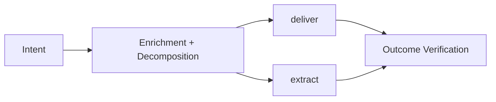

# Autoship System Overview

**Date:** 2026-04-22
**Status:** draft
**Scope:** Top-level product framing above the `extract` and `deliver` module docs

## Purpose

Autoship is not one monolithic pipeline. It is a system for turning messy software or messy product requests into bounded, reviewable, executable work.

At the top level, the system has four concerns:

1. **Intent**
Humans or external systems surface a problem, request, hypothesis, or opportunity.

2. **Enrichment + decomposition**
The system grounds that input against codebase reality, prior decisions, and observable evidence, then decides whether it is one work item or several.

3. **Delivery**
The system turns an approved work item into a trustworthy execution contract, then drives oracle, build, review, and validation.

4. **Outcome verification**
After delivery, the system checks whether the intended outcome actually happened and feeds the result back into future decisions.

These are better treated as **concerns**, not one rigid global state machine. Enrichment can recur during grooming, decomposition can happen before or during delivery, and approval exists at multiple cost and risk boundaries.

## Current Module Map

### `extract`

`extract` handles the **unknown software** problem.

Input shape:
- prototype app
- existing codebase with weak or missing product artifacts
- screenshots, journeys, demo flows, sample data

Output shape:
- reconstructed intent
- artifact pack
- oracle-ready build contract

Canonical doc: [extract-architecture.md](/Users/shyangcalibrax/Documents/Projects/autoship/docs/architecture/extract-architecture.md)

### `deliver`

`deliver` handles the **known repo, bounded change** problem.

Input shape:
- approved issue or approved work item
- existing codebase
- current tests and local conventions

Output shape:
- trustworthy brief
- oracle/build handoff
- validated shipped change

Canonical doc: [deliver-architecture.md](/Users/shyangcalibrax/Documents/Projects/autoship/docs/architecture/deliver-architecture.md)

## Human vs Agent Boundary

Humans should primarily interact through an outer workflow surface such as Linear, GitHub, Slack, or a future autoship-native UI.

Agents should primarily operate on inner execution artifacts that are stable, reviewable, and version with the code.

That creates a deliberate split:

- **Outer workflow surface**
  Human-visible status, comments, lineage, approval, priority

- **Inner execution contract**
  Briefs, oracle artifacts, review outputs, evidence, run-local state

The outer surface is for coordination.
The inner contract is for reliable execution.

### Stable knowledge vs run contract

Autoship should distinguish between:

- **Stable operating knowledge**
  How autoship works in general: reviewer/generator rules, status meanings, approval boundaries, stop conditions, and default workflow behavior.

- **Run-specific contract**
  What one active loop should do right now: which repo, which tracker/project, which issues are eligible, whether approval mode is supervised or auto, whether merge is allowed, and what "do not stop" means for this run.

That split maps naturally to two artifacts:

- **`teach-autoship.md`**
  Stable framework knowledge. Changes slowly.

- **`program.md`**
  Run-scoped marching orders for one controller loop. Changes per repo, environment, or operating mode.

Skills can teach the stable layer, but the active "non-stop" contract belongs to the run layer, not to a timeless teaching document.

These are **controller-only artifacts**. Manual operator dispatch of worker agents does not require them.

### Handoff pattern

The default pattern is:

1. Human creates or selects work in the outer workflow surface.
2. Agent enriches / grooms and writes the inner execution contract.
3. Agent hands back at an explicit approval boundary.
4. Human or reviewer-agent promotes the work to the next spend/risk stage.
5. Agent continues until the next review or `needs-human-input` boundary.

The important property is not who approves every gate. It is that the handoff is explicit and auditable.

### Workflow-surface ownership

When autoship integrates with an outer workflow surface such as Linear:

- **Workers do not mutate workflow state directly.**
  Groomers, reviewers, builders, and validators produce artifacts and structured results.

- **The controller owns tracker mutations.**
  Status changes, official milestone comments, and other Linear MCP actions happen at the controller boundary.

- **Policy lives in instructions, not worker improvisation.**
  The rules for when to comment, when to advance state, and when to stop at `needs-human-input` belong in the stable operating layer and the run contract.

This keeps the outer workflow coherent and prevents every worker from becoming its own partial state machine.

## State Philosophy

Autoship should avoid one giant end-to-end state machine for the whole product workflow.

Instead:

- top-level concerns stay loose
- each module owns its own small explicit workflow
- state transitions are introduced only where they protect real cost, risk, or ambiguity boundaries

Examples:

- `extract` owns its own probe/build workflow
- `deliver` currently owns a small local issue workflow (`new -> proposed -> changes-requested -> ready-for-oracle`)

## What Exists Today

Today, autoship is strongest in the middle of the system:

- `extract` has validated the generator-evaluator pattern at the planning layer
- `deliver` has validated the generator-evaluator pattern at the grooming layer and trustworthy brief -> build flow across Bug, Feature, and Refactor shapes

What is still less mature:

- intent capture across multiple surfaces
- prioritization
- explicit outcome verification against business/product success criteria

### Current controller pattern

The runtime shape is now:

- a **controller agent** that owns the loop
- specialized workers for grooming, review, oracle, build, and validation
- a stable autoship teaching layer
- a run-scoped contract telling the controller what to work on and when to stop

In other words:

- `teach-autoship.md` explains how autoship behaves
- `program.md` tells one controller run what to do

That preserves the successful `extract` probe pattern without collapsing stable product knowledge and per-run policy into one file.

Current implementation status:

- `extract` controller mode is live for ingest
- `deliver` controller mode is live through draft PR:
  - `claim -> pre-groom -> review -> Ready | needs-human-input`
  - after human promotion to `Building`: `worktree -> Stage 1 -> Stage 2 -> validation -> draft PR -> In Review`
- merge, deploy, and outcome verification remain future work

### Next candidates

These are placeholders, not locked commitments:

- **Next**: review + merge lane
- **Later**:
  - deploy + monitor
  - outcome verification against the original intent
  - parallel builds
  - auto-promotion past `Ready`

## Documentation Hierarchy

Use the docs in this order:

1. This file for the top-level system shape
2. [extract-architecture.md](/Users/shyangcalibrax/Documents/Projects/autoship/docs/architecture/extract-architecture.md) for the `extract` module
3. [deliver-architecture.md](/Users/shyangcalibrax/Documents/Projects/autoship/docs/architecture/deliver-architecture.md) for the `deliver` module

Do not duplicate detailed module mechanics here. This file stays intentionally light.
