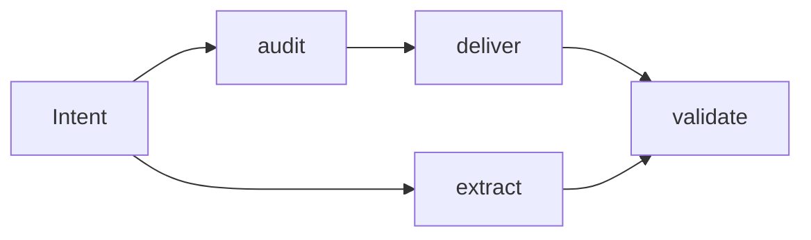

**Status:** draft · **Last updated:** 2026-04-24

## In plain English

Autoship runs the middle of software delivery — the part between *"we want to build X"* and *"X is shipped and working."*

It handles four concerns:

1. **Intent** — someone (or something) surfaces a problem, request, or hypothesis.
2. **Enrichment + decomposition** — the system grounds that input against reality (the codebase, prior decisions, observable evidence) and decides whether it's one piece of work or several.
3. **Delivery** — the system turns an approved piece of work into a trustworthy plan, then drives the code through build, review, and validation.
4. **Outcome verification** — after the change ships, the system checks whether it actually moved the thing it claimed to.

These are **concerns**, not one rigid pipeline. Enrichment can recur during grooming. Decomposition can happen before or during delivery. Approval shows up at multiple cost-and-risk boundaries, not just one.

Across all four, a human stays in the loop at the moments that matter — approving a plan, promoting work to build, reviewing the shipped change — while the agent does the grinding in between.

## Current Module Map

### Extract

Handles the **unknown software** problem.

**Input:**
- prototype app
- existing codebase with weak or missing product artifacts
- screenshots, journeys, demo flows, sample data

**Output:**
- a readable specification of what the prototype was trying to do
- a generated test suite (the "oracle" — the judge that says whether a rewrite matches the spec)
- a production-candidate rebuild, verified against the tests

Canonical doc: [extract-architecture.md](/Users/shyangcalibrax/Documents/Projects/autoship/docs/architecture/extract-architecture.md)

### Deliver

Handles the **known repo, bounded change** problem.

**Input:**
- approved issue or approved work item
- existing codebase
- current tests and local conventions

**Output:**
- a trustworthy brief (the plain-English plan for the change)
- a handoff to the build stage (the brief + a frozen test suite the build must satisfy)
- a validated code change, shipped as a draft pull request

Canonical doc: [deliver-architecture.md](/Users/shyangcalibrax/Documents/Projects/autoship/docs/architecture/deliver-architecture.md)

### Audit

Handles the **known repo, unclear readiness / unclear work queue** problem.

**Input:**
- existing production candidate or near-production repo
- launch / handoff / go-no-go context
- current deployment, CI, env, and operational setup

**Output:**
- an evidence-backed readiness report
- bounded issue candidates ranked `P0` / `P1` / `P2`
- approved tracker issues created in `Backlog`, ready to enter `deliver`

For `audit-0.1`, the workflow stops at approved issue creation. It does not fix code in the same run.

When autoship audits a repo, `.autoship/standards.yaml` is the policy source for stack choices and release expectations. Repo artifacts such as `.env.example`, CI files, and deploy config are evidence sources. If standards are missing and the repo does not already constrain the choice, the right outcome is `decision-required`, not an invented platform decision.

### Validate

*Coming soon.*

## End-to-end Flow

One repo, from readiness audit to draft pull request. `Audit` is the upstream bookend that creates bounded work; `validate` remains the downstream bookend after shipping.

```mermaid
flowchart LR
    R["Repo / launch target"]

    subgraph FUT1 ["Audit · coming soon"]
      A["AI audits repo,<br/>writes findings,<br/>proposes issues"]
    end

    subgraph TODAY ["Operational today"]
      direction LR
      BQ["Controller creates<br/>approved issues<br/>in Backlog"]
      G["Groom<br/>AI writes<br/>a shared plan"]
      HA["Approve<br/>Human promotes<br/>to Building"]
      B["Build<br/>AI writes and<br/>tests the code"]
      BQ --> G --> HA --> B
    end

    subgraph FUT2 ["Validate · coming soon"]
      V["AI checks<br/>security, quality,<br/>and outcome"]
    end

    PR["Draft pull request<br/>ready for human review"]

    R --> A
    A --> BQ
    B --> PR
    PR --> V

    classDef live fill:#eef5f1,stroke:#0d6e61,color:#0a574d
    classDef human fill:#eef2f8,stroke:#2c5488,color:#2c5488
    classDef ext fill:#f2f0e9,stroke:#8a8983,color:#575652
    classDef fut fill:#fdf8ea,stroke:#8a5510,color:#8a5510

    class BQ,G,B live
    class HA human
    class R,PR ext
    class A,V fut

    style FUT1 fill:#fdf8ea,stroke:#8a5510,stroke-width:1.5px,stroke-dasharray: 6 3,color:#8a5510
    style FUT2 fill:#fdf8ea,stroke:#8a5510,stroke-width:1.5px,stroke-dasharray: 6 3,color:#8a5510
    style TODAY fill:#f4faf7,stroke:#0d6e61,stroke-width:1px,color:#0a574d
```

## The agent roster

Autoship runs on a small set of specialized agents. Each does one thing; the controller orchestrates them.

| Agent | Module | Role | Status |
|---|---|---|---|
| **Controller** | All | The conductor. Reads the run contract, dispatches each agent in order, owns all tracker mutations. | Operational |
| **Auditor** | Audit | Inspects the repo against a fixed readiness lens and writes the audit artifact plus bounded issue candidates. | Scaffolded |
| **Audit-reviewer** | Audit | Fresh-context skeptic that judges groundedness, severity, and issue-candidate quality before any issues are created. | Scaffolded |
| **Pre-groomer** | Deliver | Writes the *brief* (plain-English plan) from an approved issue. | Operational |
| **Brief-reviewer** | Deliver | Judges the brief. Separate agent from the one that wrote it. | Operational |
| **Oracle writer** | Deliver | Writes the *oracle* (tests) from the approved brief. This is the Stage 1 worker. | Operational |
| **Implementation executor** | Deliver | Writes the code; forbidden from editing the oracle. This is the Stage 2 worker. | Operational |
| **UI walker** | Extract · ingest | Drives the running demo in a browser to discover user journeys. | Operational |
| **Static probe** | Extract · ingest | Extracts the API surface and data model from source code. | Operational |
| **Data probe** | Extract · ingest | Introspects the live database to describe actual state. | Operational |
| **External probe** | Extract · ingest | Catalogs external dependencies from source analysis. | Operational |
| **Reconciler** | Extract · ingest | Merges the four probe outputs into a unified specification. | Operational |
| **Critic** | Extract · ingest | Judges whether the spec is sufficient to build against. | Operational |
| **Build-controller** | Extract · build | Dispatches per-slice build executors and runs the feedback loop. | Operational |
| **Plan-reviewer** | Extract · build | Fresh-context skeptic between slice planning and the build. Must approve before code is written. | Operational |
| **Validation agents** | Validate | Check security, code quality, and outcome against stated intent. | Coming soon |

### Design principles shared across all agents

- **Fresh context window every time.** No long-running sessions.
- **Generator-evaluator at every handoff.** The agent that writes an artifact never judges it.
- **Strict ownership.** The controller never writes code. Workers never touch tracker state.

## Human vs Agent Boundary

Humans should primarily interact through an outer workflow surface such as Linear, GitHub, Slack, or a future autoship-native UI.

Agents should primarily operate on inner execution artifacts that are stable, reviewable, and version with the code.

That creates a deliberate split:

- **Outer workflow surface**
  Human-visible status, comments, lineage, approval, priority

- **Inner execution contract**
  Briefs, oracle artifacts, review outputs, evidence, run-local state

The outer surface is for coordination.
The inner contract is for reliable execution.

For `audit`, the controller is also the only actor allowed to create tracker issues. Workers may propose issue candidates inside the audit artifact; only the controller materializes approved ones in Linear or GitHub.

### Stable knowledge vs run contract

Autoship should distinguish between:

- **Stable operating knowledge**
  How autoship works in general: reviewer/generator rules, status meanings, approval boundaries, stop conditions, and default workflow behavior.

- **Run-specific contract**
  What one active loop should do right now: which repo, which tracker/project, which issues are eligible, whether approval mode is supervised or auto, whether merge is allowed, and what "do not stop" means for this run.

That split maps naturally to two artifacts:

- **`.claude/agents/controller.md`**
  Stable framework knowledge plus per-mode procedure. Changes slowly. Holds the load-bearing discipline (workflow-surface ownership, generator-evaluator separation, disk-backed state, NEVER STOP) inline with each mode's loop. Collapsed here from the former `autoship-controller` skill because it had a single reader and the split was creating drift.

- **`program.md`**
  Run-scoped marching orders for one controller loop. Changes per repo, environment, or operating mode.

- **`.autoship/standards.yaml`**
  Repo-local policy. Captures the standards autoship should assume for hosting, CI, observability, secrets, and release expectations.

Skills can teach the stable layer, but the active "non-stop" contract belongs to the run layer, not to a timeless teaching document.

These are **controller-only artifacts**. Manual operator dispatch of worker agents does not require them.

### Handoff pattern

The default pattern is:

1. Human creates or selects work in the outer workflow surface.
2. Agent enriches / grooms and writes the inner execution contract.
3. Agent hands back at an explicit approval boundary.
4. Human or reviewer-agent promotes the work to the next spend/risk stage.
5. Agent continues until the next review or `needs-human-input` boundary.

The important property is not who approves every gate. It is that the handoff is explicit and auditable.

### Workflow-surface ownership

When autoship integrates with an outer workflow surface such as Linear:

- **Workers do not mutate workflow state directly.**
  Groomers, reviewers, builders, and validators produce artifacts and structured results.

- **The controller owns tracker mutations.**
  Status changes, official milestone comments, and other Linear MCP actions happen at the controller boundary.

- **Audit-created issues start in `Backlog` by default.**
  Audit does not silently throw new work straight into execution. The controller creates approved issues in `Backlog`; `deliver` begins when an issue is later promoted to `Grooming`.

- **Policy lives in instructions, not worker improvisation.**
  The rules for when to comment, when to advance state, and when to stop at `needs-human-input` belong in the stable operating layer and the run contract.

This keeps the outer workflow coherent and prevents every worker from becoming its own partial state machine.

## State Philosophy

Autoship should avoid one giant end-to-end state machine for the whole product workflow.

Instead:

- top-level concerns stay loose
- each module owns its own small explicit workflow
- state transitions are introduced only where they protect real cost, risk, or ambiguity boundaries

Examples:

- `extract` owns its own probe/build workflow
- `audit` will own a bounded audit workflow (`new -> audited -> approved-to-create -> issues-created`)
- `deliver` owns the issue workflow that starts once a bounded issue exists and enters `Grooming`

## What Exists Today

Today, autoship is strongest in the middle of the system:

- `extract` has validated the **generator-evaluator** pattern at the planning layer — the agent that *writes* a plan never grades its own plan; a separate reviewer agent does.
- `deliver` has validated the same pattern at the grooming layer, plus the trustworthy-brief-to-build flow across Bug, Feature, and Refactor shapes

What is still less mature:

- intent capture across multiple surfaces
- prioritization
- explicit outcome verification against business/product success criteria

### Current controller pattern

The runtime shape is now:

- a **controller agent** that owns the loop
- specialized workers for grooming, review, oracle, build, and validation
- a stable autoship teaching layer
- a run-scoped contract telling the controller what to work on and when to stop

In other words:

- `.claude/agents/controller.md` explains how autoship behaves (stable discipline + per-mode procedure)
- `program.md` tells one controller run what to do

That preserves the successful `extract` probe pattern without collapsing stable product knowledge and per-run policy into one file.

Current implementation status:

- `extract` controller mode is live for ingest
- `deliver` controller mode is live through draft PR:
  - `claim -> pre-groom -> review -> Ready | needs-human-input`
  - after human promotion to `Building`: `worktree -> Stage 1 -> Stage 2 -> validation -> draft PR -> In Review`
- `audit` now has scaffolded controller + worker contracts:
  - `assess repo -> review findings -> create approved issues in Backlog -> stop`
  - the shape exists, but it is not yet probe-validated the way `extract` and `deliver` are
- merge, deploy, and outcome verification remain future work

### Next candidates

These are placeholders, not locked commitments:

- **Next**: review + merge lane
- **Later**:
  - deploy + monitor
  - outcome verification against the original intent
  - parallel builds
  - auto-promotion past `Ready`

## Documentation Hierarchy

Use the docs in this order:

1. This file for the top-level system shape
2. [extract-architecture.md](/Users/shyangcalibrax/Documents/Projects/autoship/docs/architecture/extract-architecture.md) for the `extract` module
3. [deliver-architecture.md](/Users/shyangcalibrax/Documents/Projects/autoship/docs/architecture/deliver-architecture.md) for the `deliver` module
4. [audit-architecture.md](/Users/shyangcalibrax/Documents/Projects/autoship/docs/architecture/audit-architecture.md)

Do not duplicate detailed module mechanics here. This file stays intentionally light.
