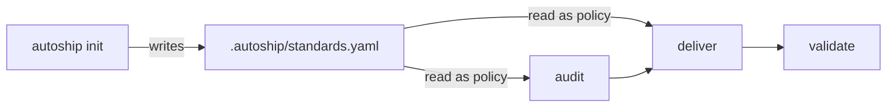

**Status:** Operational · **Last updated:** 2026-04-29

## In plain English

Autoship runs the middle of software delivery — the part between *"we need to understand or build X"* and *"X is reviewed, tested, and ready for a human decision."*

The live product has two runtime surfaces:

1. **Audit** — evidence-backed production readiness assessment that can create bounded issue candidates.
2. **Deliver** — issue-to-spec-to-oracle-to-implementation flow that ends at a draft pull request.

Both modes read repo policy from `.autoship/standards.yaml`, scaffolded by `autoship init` and owned by the operator after first install. Standards is setup config, not a runtime mode.

Validate remains future work. Extract is retired from the live product; its implementation and research notes are archived under `docs/archive/extract/`.

## The layer model

Autoship is a 6-layer stack. Each layer has a clear owner, a stable upward contract, and can be swapped without rewriting the layers above it. **Layer 3 (agents + skills) is autoship's actual IP; the other five layers are plumbing.**

```
┌────────────────────────────────────────────────────────────┐
│  L5  External tracker     Linear / GitHub / future UI      │  ← operator workspace
├────────────────────────────────────────────────────────────┤
│  L4  State                .autoship/                       │  ← operator + autoship
│      standards.yaml, defaults.yaml, runners.yaml,          │
│      issues/<id>/{spec,oracle,implementation,verification},│
│      runs/<run-id>/{inferences.jsonl, decisions.log}       │
├────────────────────────────────────────────────────────────┤
│  L3  Agents + Skills      .claude/                         │  ← autoship IP
│      11 agents (controller + workers)                      │
│      8 skills (autoship-owned + vendored disciplines)      │
├────────────────────────────────────────────────────────────┤
│  L2  Adapter              .autoship/runners.yaml + glue    │  ← autoship per harness
│      dispatch contract, model_tier → model map,            │
│      skills-format translation                             │
├────────────────────────────────────────────────────────────┤
│  L1  Harness runtime      Claude Code / pi / flue /        │  ← harness vendor
│                            OpenHands                       │
│      agent invocation, model access, tool execution        │
├────────────────────────────────────────────────────────────┤
│  L0  Distribution         curl install / plugin install /  │  ← package channel
│                            git clone / npm                 │
└────────────────────────────────────────────────────────────┘
```

### Per-layer ownership

| Layer | What lives there | Owner | Swap consequence |
|---|---|---|---|
| **L5 Tracker** | Linear/GitHub state, comments, PR threads | Operator | Switch tracker = change `.autoship/standards.yaml` source block + small controller adapter. Operator-visible UX changes; agents untouched. |
| **L4 State** | Per-repo policy + per-issue evidence + per-run artifacts | Operator (filled) + autoship (templates scaffolded) | Moving off filesystem = significant rewrite. The filesystem-as-source-of-truth invariant is load-bearing across the design. |
| **L3 Agents + Skills** | Workflow logic, worker behavior, disciplines | **Autoship — this is the product** | Editing here = changing autoship's behavior. Most autoship PRs touch this layer. |
| **L2 Adapter** | runners.yaml + per-harness invocation translation | Autoship (one per harness) | Adding a harness = new adapter package; L3 untouched. This is the multi-harness commitment surface. |
| **L1 Harness** | Spawn fresh-context agent, give it tools + model, return structured output | **Not autoship** (Anthropic / earendil-works / OpenHands maintainers) | Operator's choice. Autoship is a guest; harness vendor owns runtime quality. |
| **L0 Distribution** | How L3 files reach the operator | Package channel | Switching channels = packaging change, zero code impact. |

### Contracts between layers

Each layer promises the layer above a bounded interface:

- **L1 → L2**: "spawn an agent with prompt + tool allowlist; return structured output"
- **L2 → L3**: "your `model_tier: high` resolves to an appropriate model; your prompt is dispatched; result.md frontmatter is parsed"
- **L3 → L4**: "I write only to `.autoship/issues/<id>/<my-artifact>/` and follow the documented schema"
- **L4 → L5**: "the controller mirrors handoffs to the tracker per runners.yaml's posting policy"

When a layer's contract is clear, the layer above doesn't care how it's implemented. This is what makes harness-portability and tracker-portability feasible without rewriting the workflow.

### Why this taxonomy matters

The layer model is the canonical mental map for autoship contributors. When deciding where new behavior belongs, ask: *what's the smallest layer that owns this concern?*

- "We need to talk to a new tracker" → L4/L5, not L3
- "We need to support a new harness" → L2 (adapter), not L3
- "We need a different install path" → L0, not L1+
- "We need a new workflow phase" → L3, almost always

If a change spans multiple layers, that's a signal one of the layer contracts is wrong. Fix the contract first.

## Current Module Map



### Standards (setup artifact)

Handles the **repo policy bootstrap** problem.

`.autoship/standards.yaml` is owned by the `autoship init` CLI. On install, init walks repo evidence (package manifests, CI workflows, deploy config, migration tools, observability SDKs, async/queue libs, dependency-scan config) and fills high-confidence values directly into the YAML, annotating each with `# inferred from <evidence>`. Ambiguous values stay `SET_ME` and are treated as decision-required by audit.

Re-running `autoship init` on an existing `.autoship/` prints an advisory of fills and conflicts based on current evidence — it never modifies the file. Operators copy any fills they want into `standards.yaml` manually. autoship does not silently overwrite the file once it exists.

Standards are policy, not trigger config. They tell audit and deliver what the repo expects; they do not decide which run mode starts.

### Audit

Handles the **known repo, unclear readiness / unclear work queue** problem.

**Input:**
- production candidate or near-production repo
- launch / handoff / go-no-go context
- current deployment, CI, env, and operational setup

**Output:**
- an evidence-backed readiness report
- bounded issue candidates ranked `P0` / `P1` / `P2`
- optional Linear issues created in `Backlog`, ready to enter `deliver`

Audit may include a safe external exposure smoke test when the run provides `--external-url=<url>`. That covers public-edge readiness such as TLS, headers, CORS, public API auth gates, cache behavior, and debug/docs exposure. It must not run destructive probes.

Canonical docs:
- [audit-architecture.md](docs/architecture/audit-architecture.md)
- [audit-tracker-sync.md](docs/architecture/audit-tracker-sync.md)

### Deliver

Handles the **known repo, bounded change** problem.

**Input:**
- approved issue or local issue file
- existing codebase
- current tests and local conventions

**Output:**
- a trustworthy spec
- a frozen evidence oracle
- a validated code change, shipped as a draft pull request

Canonical doc: [deliver-architecture.md](docs/architecture/deliver-architecture.md)

### Validate

*Coming soon.*

Validate is the downstream bookend: after a change ships, check whether it actually moved the thing it claimed to.

## Agent Roster

Autoship runs on a small set of specialized agents. Each does one thing; the controller orchestrates them.

| Agent | Module | Role | Status |
|---|---|---|---|
| **autoship-controller** | Core | Resolves triggers into RunRequests, dispatches workers, owns tracker mutations. | Operational |
| **audit-auditor** | Audit | Inspects the repo and writes the audit artifact plus bounded issue candidates. | Scaffolded |
| **audit-reviewer** | Audit | Fresh-context skeptic that judges groundedness, severity, tracker annotations, and issue-candidate quality. | Scaffolded |
| **deliver-pre-groomer** | Deliver | Writes the spec from an approved issue. Switches to writing `decomposition.md` for umbrella issues. | Operational |
| **deliver-spec-reviewer** | Deliver | Judges the spec. Separate agent from the one that wrote it. | Operational |
| **deliver-decomposition-reviewer** | Deliver | Judges the decomposition for umbrella issues, including typed question discipline. Separate agent from the one that wrote it. | Operational (0.4.2) |
| **deliver-oracle-writer** | Deliver | Designs the frozen evidence oracle from the approved spec. | Operational |
| **deliver-implementation** | Deliver | Writes the code; forbidden from editing the oracle. | Operational |
| **Validation agents** | Validate | Check security, quality, and outcome against stated intent. | Coming soon |

## How It Stays Honest

- **Fresh context per unit.** Workers run in clean sessions instead of accumulating stale context.
- **Generator-evaluator at every handoff.** The author of an artifact does not judge it.
- **Mechanical checks go to the controller.** Commands, file existence, parseable verdicts, and hash checks are mechanical.
- **Judgment goes to reviewers.** Groundedness, scope, severity, and implementation-worthiness require a fresh evaluator.
- **Strict ownership.** The controller never writes code. Workers never touch tracker state.
- **Sharp policy/execution seam.** Operators own the *bar* (what counts as production-ready, what counts as passing, when humans must approve) via `standards.yaml` and explicit overrides in `defaults.yaml`. The controller owns the *path* (how to discover, how to execute, how to verify). Routine path-picking is inferred from repo evidence, logged structurally to `runs/<run-id>/inferences.jsonl`, and announced at run start — operators get an audit trail without having to restate evidence as config.
- **Durable artifact for every meaningful remote outcome.** On remote runs, every grooming outcome that produced agent analysis (spec, decomposition, need-info, blocked, cannot-reproduce) persists as a draft PR with the artifact tree on a branch. Trigger.dev's ephemeral worktree cannot be the only home for analysis — if the run produced something the operator might review, it is captured durably. Capability halts are exempt because they have no analysis to persist.

## State And Configuration

Live autoship has no `.autoship/program.md`.

- **RunRequest** — normalized run intent, resolved from: prompt flags → optional `.autoship/defaults.yaml` overrides → runtime inference from repo evidence → framework defaults. Snapshotted as `run.json` under each run directory.
- **`.autoship/standards.yaml`** — repo policy contract. Commit this file. The operator-owned source of truth for what good looks like in this repo (hosting, CI, observability, secrets, release expectations).
- **`.autoship/defaults.yaml`** — optional per-repo overrides. Empty/absent is fine — autoship infers source, scope, and validation from repo evidence at runtime. Use this file only when you want to lock down explicit choices that override the inference. Flags always win.
- **`.autoship/runners.yaml`** — harness dispatch contract (0.6.0+). Declares which harness the controller dispatches workers to (subprocess invocation, SDK, or HTTP). Default is `claude-code`; the file is forward-compat scaffolding so additional adapters (flue, pi extension, OpenHands) can land without controller refactors. See § Harness interface below.
- **`.autoship/audits/<run-id>/`** — audit artifacts.
- **`.autoship/runs/<run-id>/`** — deliver run logs and snapshots: `run.json` (resolved RunRequest), `invocation.txt` (raw trigger), `decisions.log` (prose state-transition log), `inferences.jsonl` (structured inference trail; see [decision-log.md](docs/architecture/decision-log.md)).
- **`.autoship/issues/<id>/`** — deliver issue mirror, spec, reviews, oracle, implementation, verification, and PR artifact.

## Workflow-Surface Ownership

Humans should primarily interact through an outer workflow surface such as Linear, GitHub, Slack, or a future autoship UI.

Agents should primarily operate on inner execution artifacts that are stable, reviewable, and version with the code.

When autoship integrates with Linear:

- Workers produce artifacts and structured results.
- The controller owns status changes, official milestone comments, issue creation, and relations.
- Audit-created issues start in `Backlog` by default.
- Deliver starts only after an issue source and validation commands are configured.

### State-as-baton handoff

In deliver, the Linear workflow-state column carries the human ↔ agent baton. Cards in `In Progress` mean autoship is working; cards anywhere else mean it's the operator's turn. The recommended remote states are action-based: `Run Agent` means "agent may analyze and, if clear, build"; `Breakdown Proposed` means "review the breakdown PR"; `Breakdown Approved` means "create child issues and start dependency-free slices"; `Needs Attention` means "autoship halted on a typed blocker." `Spec Ready` remains optional supervised compatibility. Each milestone fires a state change + @mention comment when posting is enabled — kanban for the glance, Inbox for the notification. State transitions are best-effort: if a target state is missing in the workspace, the comment still posts. See [deliver-architecture.md](docs/architecture/deliver-architecture.md) for the full transition table.

## Harness interface

Autoship's workflow logic, state machine, and agent prompts are intentionally **harness-agnostic and model-agnostic**. The product ships today on Claude Code, but the underlying contract is small enough that other agent runtimes can host the same workflow with a thin adapter.

A harness must implement two operations:

1. **Spawn a fresh-context agent session** with a pre-injected prompt and tool allowlist. Return a session handle / log stream.
2. **Await completion and surface the worker's `result.md` frontmatter** (or equivalent structured output) so the controller can parse outcomes and decide next dispatch.

Everything else — issue state under `.autoship/issues/<id>/`, RunRequest resolution, tracker mutations, inference logging, enum validation, generator-evaluator pairing — lives above the harness. Workers do not depend on which runtime is below.

Per-harness packaging takes the shape most native to that runtime. Today's targets:

| Harness | Invocation model | Packaging | Status |
|---|---|---|---|
| **Claude Code** | Subprocess: `claude --agent <id> -p <prompt>` | npm package + `.claude/agents/*.md` scaffolded into target repo | Production (current) |
| **flue** | Subprocess: `flue run <agent_id> --id <run_id>` | Future — flue's `task` tool maps to fresh-context dispatch; same subprocess shape as Claude Code | Feasible, adapter cost low |
| **pi-coding-agent** | In-process: pi extension registering tools backed by `pi-agent-core` | Future — autoship would ship as a pi extension package | Feasible via extension; ~bounded adapter work |
| **OpenHands** | Python SDK or REST API; Docker volume mount for filesystem state | Future — higher-cost adapter (no subprocess idiom; containerized state sync) | Feasible but more invasive |

The active harness is declared in `.autoship/runners.yaml`. Today the controller treats `claude-code` as an implicit default; the runners.yaml file is forward-compat scaffolding (the controller does not yet branch on its contents). Skills carry a portable `skill.yaml` manifest alongside each `SKILL.md` so harness-specific format translation (Claude Code's directory-bundle shape vs flue/OpenHands' single-file-with-triggers shape) can be done mechanically by adapters without rewriting skill content.

The multi-harness commitment is **conditional on real demand**. No adapter is built before a real second-harness operator asks. The hedges above (`runners.yaml`, `skill.yaml`, this section's documented contract) cost nothing today and turn the future adapter from "controller refactor" into "additive adapter package."

## Current Implementation Status

- `autoship init` scaffolds `.autoship/standards.yaml` with high-confidence repo evidence. Re-running on existing `.autoship/` prints an advisory only.
- `audit` can run report-only, or write reviewed issue candidates to Linear when explicitly approved.
- `deliver` can drive a bounded issue through `Run Agent` → groom/review → oracle → implementation → verification → draft PR (`In Review`) in automatic mode, or through optional supervised `Spec Ready` before build. Umbrella issues route to a reviewed `[Breakdown]` PR, then `Breakdown Approved` / `autoship create-issues <id>` creates children and starts dependency-free slices.
- **Trust architecture (0.3.0):** the controller infers source, Linear scope, and validation commands from repo evidence at runtime; each inference is announced at run start and logged structurally to `runs/<run-id>/inferences.jsonl`. `defaults.yaml` is therefore optional override rather than required setup. Real ambiguity (multi-team workspace, no detectable test infra) still halts; routine path-picking proceeds with a logged trail.
- merge, deploy, and outcome verification remain future work.

## Documentation Hierarchy

Use the docs in this order:

1. This file for the top-level live system shape.
2. [audit-architecture.md](docs/architecture/audit-architecture.md) for audit.
3. [audit-tracker-sync.md](docs/architecture/audit-tracker-sync.md) for Linear audit issue sync.
4. [deliver-architecture.md](docs/architecture/deliver-architecture.md) for deliver.
5. [decision-log.md](docs/architecture/decision-log.md) for the runtime inference audit trail (`inferences.jsonl` schema).

Archived extract material is historical only: `docs/archive/extract/`.
