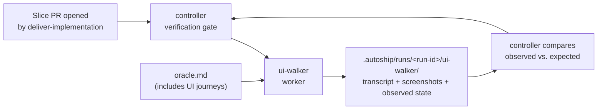

**Status:** Design · **Last updated:** 2026-05-15

> **Scope.** This document captures the v1 design for a `ui-walker` worker agent in live autoship. It supersedes the retired `extract-ui-walker` (archived under `docs/archive/extract/`). Nothing here ships until the design is reviewed and a writing-plans plan is produced.

## In plain English

Deliver currently proves a slice is done with unit, integration, and contract tests. None of that exercises the UI a real user would touch — a slice can ship green oracles and a broken screen.

`ui-walker` closes that gap. When a slice's PR is opened, the controller deploys `ui-walker` to drive the running app, walk the user journeys the oracle declares, capture screenshots and observed state, and hand the evidence to the controller's verification gate. The oracle judges; the walker executes. No new reviewer agent.

This is the **runtime sibling** of `deliver-implementation`: implementation satisfies code-level oracle assertions; `ui-walker` satisfies UI-level oracle assertions.

## What v1 is, and is not

**v1 ships:**

- One worker agent: `ui-walker`
- One shared skill: `ui-walking/`
- A small extension to the oracle schema: UI journey assertions (selector + expected observed state)
- Integration into the deliver gate, after `deliver-implementation` and before PR approval
- Spec mode only — oracle is the reference

**v1 explicitly does not ship:**

- Heuristic mode (UX judgment without an oracle)
- Regression mode (drift against prior baseline)
- Audit integration
- Grooming integration
- A `ui-walker-reviewer` agent

These are deferred. They can land later if v1 pays. Doing them all at once repeats the scope-creep failure mode autoship itself avoided when it shipped audit → deliver → groom in sequence.

## Why no reviewer

Autoship's generator-evaluator pattern applies where **judgment is unbounded**:

- `audit-auditor` writes an assessment (open-ended) → `audit-reviewer` judges it
- `deliver-pre-groomer` writes a spec (open-ended) → `deliver-spec-reviewer` judges it
- `deliver-oracle-writer` writes the oracle (open-ended) → `deliver-oracle-reviewer` judges it

It does **not** apply where judgment is bounded by a frozen oracle:

- `deliver-implementation` writes code → controller-owned verification against oracle tests (no reviewer agent)

`ui-walker` is in the second bucket. The oracle declares what each journey must show; the walker executes the journey and records what it actually showed; the controller compares observed vs. expected. The walker doesn't issue a free-form verdict, so there is no free-form judgment to police.

A reviewer agent re-enters the picture only if a later mode (heuristic) lets the walker judge UX without an oracle. v1 does not include that mode.

## Architecture



The flow:

1. `deliver-implementation` produces the slice PR.
2. Controller enters the verification gate and dispatches `ui-walker` with the oracle's UI journeys as input.
3. `ui-walker` boots the app (using `defaults.yaml` start command or repo-inferred default), drives each declared journey, and writes structured evidence to `.autoship/runs/<run-id>/ui-walker/`.
4. The controller reads `verdict.json`, compares each observed state against the oracle's expected state, and decides pass/fail.
5. Pass → existing controller-owned PR approval flow. Fail → block, surface evidence to operator (mirrors how a failing oracle test blocks today).

## Agent contract

**Inputs** (passed by controller):

- `oracle.md` excerpts: the UI journey assertions for this slice
- App start command (from `defaults.yaml` → `deliver.ui.start_command` or inferred from `package.json` scripts)
- App base URL (default `http://localhost:3000`, overridable via `defaults.yaml`)
- Auth fixture reference (env var name pointing to a test user; never raw secrets)
- Run paths: `.autoship/runs/<run-id>/ui-walker/` for outputs

**Outputs**:

- `report.md` — human-readable, one section per journey, screenshot links inline
- `transcript.jsonl` — append-only record: every action (navigate, click, fill, wait) + every observation (URL, visible text, console errors, network errors, screenshot path)
- `screenshots/NNN.png` — numbered, referenced from transcript
- `verdict.json` — machine-readable: `{ run_id, journeys: [{name, oracle_ref, status: pass|fail|inconclusive, observed: {...}, evidence_refs: [...]}] }`

**Voice (load-bearing prompt instruction):**

> You are the executor of the oracle's UI journeys. The oracle decides what is correct; you do not. Your job is to drive the app as the journey describes, observe what the app shows, capture proof, and record observed state in a form the controller can mechanically compare against the oracle's expected state. When in doubt about what is correct, do not guess — record the observed state and let the controller judge.

This voice matters: it is **not** dogfooding. Dogfooding belongs in a future heuristic mode. v1 is oracle-anchored execution.

**Tool binding**: Playwright MCP (`mcp__plugin_playwright_playwright__*`) is the planned tooling. **Open question:** confirm Playwright MCP is available in the agent environment autoship spawns. If not, this is an MCP-provisioning task before agent-design work continues.

## Skill: `ui-walking/`

One skill, fat enough to be the agent's playbook, thin enough that the agent file still drives the run.

```
.claude/skills/
  ui-walking/
    SKILL.md                 # protocol overview, when to use
    journey-execution.md     # how to walk a journey safely
    evidence-rubric.md       # what counts as proof
    failure-taxonomy.md      # broken click vs. broken state vs. broken expectation vs. flake
```

Why one skill and not three:

- The reusable atom is **"how to drive an app and capture proof,"** which is voice + mechanics + judgment-of-evidence fused. Splitting them creates seams that don't match real boundaries.
- A hypothetical future `audit-ux-static` (lint code/Figma for UX patterns) would want a different shape entirely — not a slice of this skill.

`blocker-escalation/` is reused unchanged (auth fixture missing, app won't boot, infinite redirect).

## Oracle schema extension

`deliver-oracle-writer` currently writes test contracts for code. To support `ui-walker`, the oracle gains an optional `ui_journeys` section:

```yaml
ui_journeys:
  - name: "submit-empty-form-shows-required-error"
    intent: "User clicks Submit on an empty Name field and sees a 'Required' error."
    steps:
      - navigate: "/signup"
      - click: "button[type=submit]"
    expected:
      visible_text: "Required"
      near_selector: "input[name=name]"
      url_unchanged: true
      no_console_errors: true
```

`deliver-oracle-reviewer` already judges oracle soundness — it now also judges whether `ui_journeys` are well-formed (steps deterministic, expectations assertable, no implementation-detail leakage). No new reviewer agent.

The schema is intentionally minimal in v1: steps are concrete actions, expectations are observable surface state. We do not add visual-diff thresholds, animation timing, or perceptual checks yet.

## When ui-walker fires

v1: **only** on deliver gate, after `deliver-implementation`, when the oracle declares at least one `ui_journey`. Slices with no UI journeys (pure backend slices) skip the walker entirely — no cost, no false signal.

The controller decides: "does this slice's oracle have `ui_journeys`?" If yes, dispatch walker. If no, skip. This avoids the "always-on UI checker burning tokens on backend PRs" failure mode.

## What this does not solve

- **Visual regression**: out of scope. Screenshots are evidence, not assertions. v1 does not diff screenshots against baselines.
- **Performance**: out of scope. The walker records console + network errors but does not assert load times or Core Web Vitals.
- **Accessibility audit**: out of scope. v1 does not run axe-core. (Could be added as a controller-owned mechanical smoke later — does not need an agent.)
- **Exploratory UX critique**: out of scope. That is the deferred heuristic mode.

Each of these is a deliberate cut for v1.

## Open questions

1. **Playwright MCP availability in the spawned agent environment.** Verification gate before writing any code.
2. **App-start lifecycle.** Does the controller start the app, or does the walker? Leaning controller (so the walker doesn't deal with port collisions or build steps), but needs confirmation.
3. **Auth fixtures.** What's the convention for test users in autoship-equipped repos? Likely `.autoship/standards.yaml` needs a `ui.test_auth` field; design that when the first repo needs it, not preemptively.
4. **Cost ceiling.** A walker session per slice could be expensive. We should instrument cost from v1 day one and set a soft ceiling that triggers `blocker-escalation` if a journey can't complete cheaply.

## Followups (post-v1, if v1 pays)

- Heuristic mode: dogfooding voice, no oracle, surfaces friction. Needs `ui-walker-reviewer` for bounded judgment.
- Regression mode: diff against prior run's `verdict.json` + screenshots.
- Audit integration: walker surfaces UX gaps as audit evidence.
- Groom integration: walker grounds spec in observed current behavior.
- Visual diff / a11y smoke: as controller-owned mechanical checks, not new agents.

## Next steps

1. Confirm Playwright MCP availability in the autoship agent runtime.
2. If available, produce an implementation plan via the writing-plans skill: oracle schema PR, walker agent file, `ui-walking/` skill, controller integration, smoke test on one real slice.
3. If unavailable, this becomes a Sandbox/MCP-provisioning task first.
