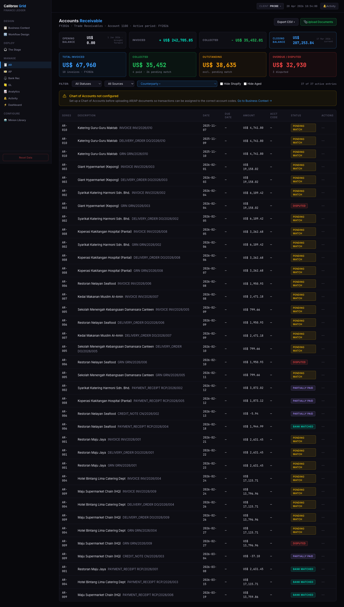

<!--
Compile:
  npx @marp-team/marp-cli@latest autoship-evidence-marp.md -o autoship-evidence-marp.html
  npx @marp-team/marp-cli@latest autoship-evidence-marp.md --pdf --allow-local-files -o autoship-evidence-marp.pdf
-->

<!-- ───────────────────────── 1. Cover ───────────────────────── -->

<!-- _class: cover -->
<!-- _paginate: false -->

Autoship · Evidence · 2026-04-20

# Demo to production, without rewriting from scratch.

Ten probes of empirical evidence that <em>extracting the spec</em> from a working demo is the hard part — and it's tractable.

<footer>autoship · internal · shyang</footer>

<!-- ───────────────────────── 2. Problem ───────────────────────── -->

---

The problem

# A great demo is the worst brief.

- The prototype **works** — and customers want it.
- Every quirk, layout choice, and business rule is already decided in code.
- Nobody wrote the spec. The code *is* the spec.
- Hand-rewrites lose intent and cost months.

$$

Months of eng time, lost design intent, and a rewrite that doesn't quite match the demo that won the deal.

<footer>02 · the problem</footer>

<!-- ───────────────────────── 3. Why rewrites fail ───────────────────────── -->

---

Why rewrites fail

# You can't write the spec by hand — the demo already <em>is</em> one.

The prototype encodes hundreds of decisions: status-pill colors, filter semantics, empty-state copy, the exact 8-column table schema, the waterfall math on the balance cards.

A human spec captures maybe 10%. The rest shows up as "bug reports" months later — when it's the <strong>rewrite</strong> that's wrong, not the demo.

<footer>03 · why rewrites fail</footer>

<!-- ───────────────────────── 4. Thesis ───────────────────────── -->

---

The thesis

# Extracting the spec is hard. Rebuilding from a good spec is <em>tractable</em>.

Conventional wisdom: "code generation is the hard part."

<strong>We invert this.</strong> Modern LLMs can rebuild competently from a clean spec — if you give them one. The work is turning the messy demo <em>into</em> that spec.

<footer>04 · thesis</footer>

<!-- ───────────────────────── 5. Mechanism ───────────────────────── -->

---

How it works

# Two stages.

### 1 · Reverse-spec-extraction

Four probe agents walk the demo in parallel:
- ui-walker — clicks every screen
- static — reads the code
- data — pulls sample rows & PDFs
- external — maps API calls

A reconciler merges them into an **artifact pack** — 6 structured files + screenshots.

### 2 · Ralph-loop build

A build-controller slices the work by **user journey** and dispatches per-slice executors.

Each slice is verified by:
- oracle test suite
- Playwright journey walks
- **side-by-side screenshot check** against the prototype

demo → extract → artifact pack → build → production candidate

<footer>05 · mechanism</footer>

<!-- ───────────────────────── 6. Probe ladder ───────────────────────── -->

---

Evidence · the probe ladder

# Ten probes. Convergence.

<table>
<thead>
<tr><th>Probe</th><th>Wall-clock</th><th>What was tested</th><th>Key outcome</th></tr>
</thead>
<tbody>
<tr><td>0</td><td class="wall">—</td><td>Manual end-to-end ingest</td><td>Pipeline shape validated</td></tr>
<tr><td>1</td><td class="wall">1h 24m</td><td>Automated ingest</td><td>Fan-out dispatch + schemas prevent thin merges</td></tr>
<tr><td>1.5</td><td class="wall">59m</td><td>Controller agent (Track 2)</td><td>Autonomous orchestration validated</td></tr>
<tr><td>2</td><td class="wall">55m</td><td>First Ralph-loop build</td><td>4.5K lines, 45 endpoints, 11 pages — zero human help</td></tr>
<tr><td>2.1</td><td class="wall">5h 16m</td><td>Build-controller + slices</td><td>API 122/122; frontend still a shell</td></tr>
<tr><td>2.2</td><td class="wall">2h 5m</td><td>Playwright journey tests</td><td>28/29 fail on selector mismatch; orphan pages</td></tr>
<tr><td>2.3</td><td class="wall">1h 58m</td><td>Journey-based slicing</td><td>Orphans fixed; <em>dialog theater</em> exposed</td></tr>
<tr><td>2.4</td><td class="wall">4h 16m</td><td>Sample-data + screenshot contract</td><td>Gates absorbed; self-evaluation is the structural cause</td></tr>
<tr class="hilite"><td><strong>2.5</strong></td><td class="wall">4h 27m</td><td><strong>Generator-evaluator</strong> (plan-reviewer)</td><td><strong>Validated — reviewer caught 4 failures; 14/14 journeys · 145/145 oracle</strong></td></tr>
</tbody>
</table>

Each probe isolates one layer, finds its failure mode, and fixes it. Discipline, not luck.

<footer>06 · probe ladder</footer>

<!-- ───────────────────────── 7. Moment of proof ───────────────────────── -->

---

The moment of proof

# Same structure. Real data.

<figure>

REFERENCE · prototype AR page on empty tenant (all US$ 0)

</figure>

<figure>

BUILT · autoship output, seeded with prototype's own data

</figure>

37 real transactions · Malay counterparties · US$ 254,796 invoiced · pill colors, filter row, waterfall math, amber CoA warning — all <strong>extracted from the prototype</strong>, then rebuilt. <em>Strictly stronger</em> evidence than matching an empty page.

<footer>07 · proof</footer>

<!-- ───────────────────────── 8. Failure modes found & fixed ───────────────────────── -->

---

Failure modes we found & fixed

# We learn the system by breaking it.

### Orphan pages (2.2)
Slicing by database table left the cross-cutting pages (Dashboard, Analytics) as scaffolds. **Fix:** slice by user journey instead.

### Dialog theater (2.3)
Buttons opened dialogs that closed without doing anything. **Fix:** every task must assert *post-action state*, not just "dialog appears."

### Empty-tenant blind spot (2.3)
The build never rendered a populated row. **Fix:** seed the prototype's own data before journey walks.

### Self-evaluation (2.4 → 2.5)
When the same agent plans the work *and* judges its own plan, it passes every gate while cutting scope. **Fix:** separate author from judge. Validated in 2.5 — reviewer caught 4 plan-level failures.

<footer>08 · failure modes</footer>

<!-- ───────────────────────── 9. What this unlocks ───────────────────────── -->

---

What this unlocks for Calibrax

# A fast path from prototype to product.

<h3>Keep momentum</h3>

Prototype in days, productize in days. Design intent survives — because the prototype <em>is</em> the spec.

<h3>Repeatable</h3>

The method works per-probe, so it works per-prototype. Each new Calibrax demo plugs into the same pipeline.

<h3>Disciplined</h3>

Every failure becomes a probe, a fix, and a piece of institutional memory — not a regression.

The prototype isn't a deliverable anymore. It's <strong>upstream of the product</strong>.

<footer>09 · unlock</footer>

<!-- ───────────────────────── 10. Roadmap ───────────────────────── -->

---

Roadmap

# From rewrite tool to <em>rewrite-and-harden</em> tool.

JUST COMPLETED · PROBE 2.5

### Generator-evaluator validated.

plan-reviewer caught 4 plan-level failures across 2 cycles: S08 bundle, deferred-action Uploads, scope leak, consistency drift.

Build shipped clean: **14/14 journeys · 145/145 oracle**. Reviewer cost **&lt;2%** of probe total.

The absorb-and-reproduce cycle that required probes 2.2→2.3→2.4 is broken at the planning layer.

NEAR-TERM · THREE TRACKS

### Probe 2.6 · interaction fidelity
Static UI handler extraction + reconciler journey-interactions merge. Next probe, already queued.

### App shell scaffold
Pre-built monorepo: shared components, schema helpers, seed bootstrap. Probes start at the slice-loop.

### Multi-model reviewer
Codex alongside plan-reviewer. Different training distribution, different blind spots — complementary to 2.5, not corrective.

BIGGER SHIFT

### Constrained artifact improvement loop

Between extract and build, insert specialized hardeners: data, api-envelope, a11y, missing-index, error-boundary.

v1 — constrained: same behavior as demo, but hardened. v2 — <strong>strictly better than the demo</strong>.

Faster to start (shell) · more honest in judgment (multi-model) · eventually <strong>strictly better than the demos that seeded it</strong>.

<footer>10 · roadmap</footer>

<!-- ───────────────────────── 11. Ask ───────────────────────── -->

---

The ask

# The pattern works. Help us compound it.

- **A second prototype to probe against.** Probe-2.5 proved the loop converges on one demo. Generalization is the next thesis — pick a Calibrax prototype with a real customer story.
- **30 minutes with a PM** who's lived a demo→production rewrite. Where did *your* spec leak?
- **Resources for the roadmap.** Shell + multi-model reviewer + hardening loop are tractable next steps, not speculative.

This is no longer a hypothesis under test. It's the first validated architectural change of the probe series.

— probe 2.5 · 2026-04-20

<footer>11 · ask</footer>

<!-- ───────────────────────── 12. Closing ───────────────────────── -->

<!-- _class: divider -->
<!-- _paginate: false -->

---

Thank you

# Questions, objections, prototypes.

shyang@calibrax &nbsp;·&nbsp; autoship · v0.2 · 2026-04-20

